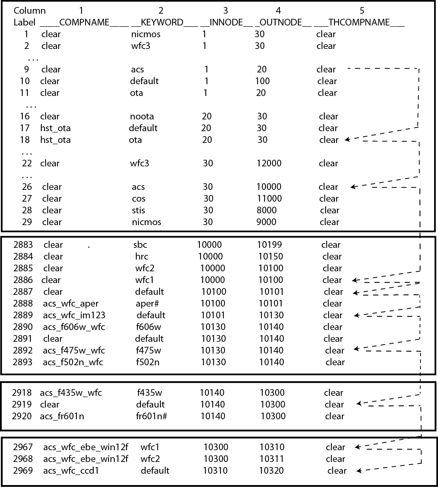
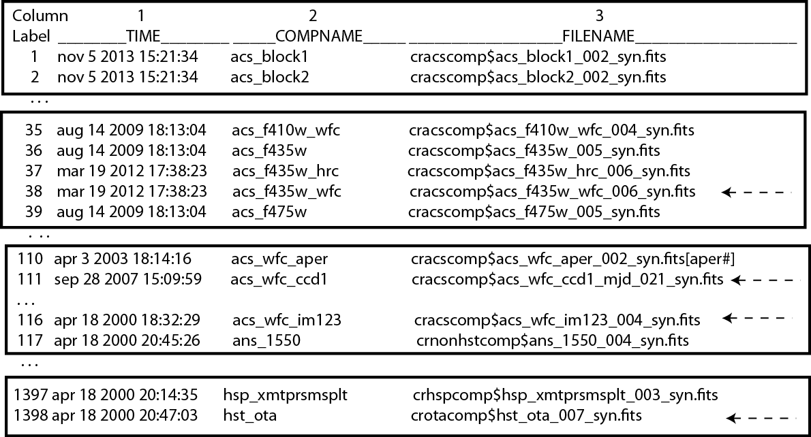

.. _pysynphot-appendixc:

***********************************
Appendix C: TMG, TMC, and TMT Files
***********************************

**pysynphot** computes the combined throughput for an
:ref:`observing mode <pysynphot-obsmode-bandpass>` (``obsmode``) with the
following steps:

#. The comma-separated ``obsmode`` is broken into individual keywords,
   each becoming a component of the ``obsmode``.
#. The individual components or keywords are used to search the
   :ref:`graph table <pysynphot-graph>`, which has 6 columns, starting at the
   row with the lowest ``INNODE`` value. All rows with this ``INNODE`` are
   examined. The row whose keyword matches one of the keywords in the
   ``obsmode`` is selected. If no such row is found, the row with the keyword
   "default" is selected. If there is no such row and there is only one
   entry with the current ``INNODE``, then this row is selected. Otherwise,
   an exception is raised.
#. Once the row is selected, the component name that is not "clear" is saved
   for its throughput lookup in a later step. "Clear" components are discarded
   because their throughput will not modify the combined throughput.
#. The ``OUTNODE`` of the selected row becomes the new ``INNODE``, and the
   process of searching the graph continues until the ``OUTNODE`` is not
   found in the graph table. For example, see :ref:`Figure 1 <fig-tmg>`.
#. Once all of the component names are found in the instrument graph
   table, the :ref:`component lookup table <pysynphot-master-comp>`
   (i.e., the TMC table), which has 4 columns, is searched for the
   actual names of the throughput tables, matching by the ``COMPNAME`` column.
   For example, see :ref:`Figure 2 <fig-tmc>`.
#. Once the throughput values are read from the component throughput tables,
   they are resampled onto the specified wavelength set (if necessary) and
   multiplied together to form the combined throughput.

The :meth:`~pysynphot.obsbandpass.ObsModeBandpass.thermback` method actually
traverses the graph table *twice*; Once in the usual fashion, using the
``COMPNAME`` column; And once to obtain the optical train necessary for thermal
calculations for IR detectors, using the ``THCOMPNAME`` column. These trains
differ because of the existence of opaque but emissive components in the optical
path, such as the spider that supports the HST secondary mirror.

The graph table is used to obtain the train of thermally emissive components in
the same way it is used for optical components, except that:

* ``obsmode`` keywords are compared to the thermal component name
  (``THCOMPNAME``) instead of the usual ``COMPNAME``.
* Once all of the component names are found in the graph table, the thermal
  component lookup table (i.e., the TMT table) is searched for the actual
  filenames of the emissivity tables. This file has the same format as the
  TMC file.

Further details and examples can be found in
:ref:`Diaz (2012) <synphot-ref-diaz2012>`.

.. _fig-tmg:

   This figure shows the path followed in the graph table (TMG) to gather the
   components that make the "acs,wfc2,f435w" observing mode. In this example,
   the keywords are mapped to the components "hst_ota", "acs_wfc_im123",
   "acs_f435w_wfc", "acs_wfc_ebe_win12f", and "acs_wfc_ccd1".

.. _fig-tmc:

   This figure shows the component table (TMC) with the filenames of the
   components mentioned in :ref:`Figure 1 <fig-tmg>`.

.. _pysynphot-graph:

Graph Table (TMG)
=================

The instrument graph table has 6 columns, as follow:

============ ====================== =======================
Column Name  Description            Data Format
============ ====================== =======================
COMPNAME     Component name         String of 20 characters
KEYWORD      ``obsmode`` keyword    String of 12 characters
INNODE       Input node             Integer
OUTNODE      Output node            Integer
THCOMPNAME   Thermal component name String of 20 characters
COMMENT [1]_ Comment (not used)     String of 68 characters
============ ====================== =======================

.. [1] The comment column is not used by **pysynphot**.
       It exists solely for documentation.

The ``COMPNAME`` column contains the name of the component. Each component
must have a unique name, as it is used as primary key for
:ref:`pysynphot-master-comp` lookup. The ``THCOMPNAME`` column is similar to
``COMPNAME`` but for :ref:`pysynphot_thermal_em`.

The ``KEYWORD`` column is used to match the component keywords in the
``obsmode`` string (also see :ref:`pysynphot-appendixb`). The same component
could be represented by multiple keywords; In that case, it will have multiple
row entries, all of which are identical except for the keywords, in the graph
table. The keyword values are not case-sensitive. The entry for a
:ref:`parameterized keyword <pysynphot-parameterized>` should contain the
keyword followed by a "#" at the end; For example, ``MJD#`` and ``aper#`` in
:ref:`Figure 3 <fig-3>`.

The ``INNODE`` and ``OUTNODE`` columns specify the light path through the HST.
They are used in the process of searching the graph, as explained
:ref:`above <pysynphot-appendixc>`. Node numbers in those columns should
increase as one goes down the light path in the instrument.

.. _fig-3:

::

  Column         1               2           3          4               5
  Label  _____COMPNAME_____ __KEYWORD___ __INNODE__ _OUTNODE__ _____THCOMPNAME_____
  1791   clear              default      8224       8225       clear
  1792   stis_os21          default      8225       8230       clear
  1793   stis_ng21_mjd      MJD#         8230       8233       clear
  1794   stis_ng21          default      8230       8233       clear
  . . . .
  2887   clear              default      10100      10101      clear
  2888   acs_wfc_aper       aper#        10100      10101      clear
  2889   acs_wfc_im123      default      10101      10130      clear
  . . . .
  3481   clear              g141         12750      12752      clear
  3482   wfc3_ir_g102_bkg   bkg          12701      12800      wfc3_ir_g102_bkg
  3483   wfc3_ir_g102_src   default      12701      12800      wfc3_ir_g102_src
  3484   wfc3_ir_g102_bkg   bkg          12751      12800      wfc3_ir_g102_bkg

.. raw:: html

  

  Figure 3: Example contents of a graph (TMG) table.
  

.. _pysynphot-master-comp:

Component Table (TMC, TMT)
==========================

TMC and TMT files are the master component and thermal component lookup tables,
respectively. Both of them have the same 4 columns, as follow:

============ =============================== =======================
Column Name  Description                     Data Format
============ =============================== =======================
TIME [2]_    Insertion time (not used)       String of 26 characters
COMPNAME     Component name                  String of 18 characters
FILENAME     Throughput file name and column String of 50 characters
COMMENT [1]_ Comment (not used)              String of 68 characters
============ =============================== =======================

.. [2] The insertion time column is used by the **pysynphot**.
       It contains the time that the component file was delivered.
       It is included for documentation and to simplify traceability of the
       data files. The time format is ``yyyymmdd:HHMMSS``.

The ``COMPNAME`` column is used in TMC and TMT files to link from the
:ref:`pysynphot-graph` using the latter's ``COMPNAME`` and ``THCOMPNAME``
columns, respectively.

The ``FILENAME`` column provides the filename of the
:ref:`throughput table <pysynphot-throughput>`, which includes abbreviated
path names, as defined in ``pysynphot.locations.CONVERTDICT``.
The table must be in binary FITS format.
The entry for a :ref:`parameterized component <pysynphot-parameterized>`
should contain its filename followed by square brackets containing the
parameterized keyword; For example,
``cracscomp$acs_cor_aper_002_syn.fits[aper#]`` in :ref:`Figure 4 <fig-4>`.
For thermal component, the throughput file should contain
:ref:`thermal emissivity <pysynphot_thermal_em>` information
(see :ref:`Figure 5 <fig-5>`).

The filenames are not stored directly in the graph table because the files
themselves change more frequently than instrument light paths. Therefore, by
doing this, we can avoid modifying the more complicated graph table every time
a new version of a component throughput is delivered to CRDS.

.. _fig-4:

::

  Column            1                 2                          3
  Label _______TIME_________ ___COMPNAME____ ___________________FILENAME__________________ ____________________________COMMENT_____________________________
  7    oct 30 2013 15:44:42  acs_blocking3   cracscomp$acs_blocking3_001_syn.fits          throughput curve (all zeroes) for blocking3 filter
  8    oct 30 2013 15:44:42  acs_blocking4   cracscomp$acs_blocking4_001_syn.fits          throughput curve (all zeroes) for blocking3 filter
  9    apr 03 2003 18:14:16  acs_cor_aper    cracscomp$acs_cor_aper_002_syn.fits[aper#]    acs coronagraph encircled energy table
  1   aug 14 2009 18:13:04  acs_f115lp       cracscomp$acs_f115lp_005_syn.fits             updated files. setting throughput zero at end of curves
  11   aug 14 2009 18:13:04  acs_f115lp_sbc  cracscomp$acs_f115lp_sbc_004_syn.fits         updated files. setting throughput zero at end of curves
  . . . . .
  2313 oct 01 2013 19:55:56  stis_ng22       crstiscomp$stis_ng22_016_syn.fits             default date 57113 & end date 57480. turned mjd extrapolation on
  2314 oct 01 2013 19:55:56  stis_ng22_mjd   crstiscomp$stis_ng22_mjd_016_syn.fits[mjd#]   default date 57113 & end date 57480. turned mjd extrapolation on
  2315 oct 01 2013 19:55:56  stis_ng22b      crstiscomp$stis_ng22b_010_syn.fits            default date 57113 & end date 57480. turned mjd extrapolation on
  2316 oct 01 2013 19:55:56  stis_ng22b_mjd  crstiscomp$stis_ng22b_mjd_010_syn.fits[mjd#]  default date 57113 & end date 57480. turned mjd extrapolation on
  2317 oct 01 2013 19:55:56  stis_ng23       crstiscomp$stis_ng23_011_syn.fits             default date 57113 & end date 57480. turned mjd extrapolation on
  2318 oct 01 2013 19:55:56  stis_ng23_mjd   crstiscomp$stis_ng23_mjd_011_syn.fits[mjd#]   default date 57113 & end date 57480. turned mjd extrapolation on
  2319 oct 01 2013 19:55:56  stis_ng24       crstiscomp$stis_ng24_011_syn.fits             default date 57113 & end date 57480. turned mjd extrapolation on
  2320 oct 01 2013 19:55:56  stis_ng24_mjd   crstiscomp$stis_ng24_mjd_011_syn.fits[mjd#]   default date 57113 & end date 57480. turned mjd extrapolation on
  2321 oct 01 2013 19:55:56  stis_ng31       crstiscomp$stis_ng31_011_syn.fits             default date 57113 & end date 57480. turned mjd extrapolation on

.. raw:: html

  

  Figure 4: Example contents of a TMC table, taken from
  <i>z4k1425fm_tmc.fits</i>.
  

.. _fig-5:

::

  Column            1                 2                          3                                                4
  Label __________TIME____________ ___COMPNAME____ __________________FILENAME_________________ __________________COMMENT___________________
   116  aug 15 2006 8:00:00:000am  wfc3_ir_fold    crwfc3comp$wfc3_ir_fold_001_th.fits         Reflectivity of IR fold mirror
   117  aug 15 2006 8:00:00:000am  wfc3_ir_mir1    crwfc3comp$wfc3_ir_mir1_001_th.fits         Reflectivity of IR mirror 1
   118  aug 15 2006 8:00:00:000am  wfc3_ir_mir2    crwfc3comp$wfc3_ir_mir2_001_th.fits         Reflectivity of IR mirror 2
   119  aug 15 2006 8:00:00:000am  wfc3_ir_rcp     crwfc3comp$wfc3_ir_rcp_001_th.fits          Transmission of refractive corrector plate
   120  aug 15 2006 8:00:00:000am  wfc3_ir_wmring  crwfc3comp$wfc3_ir_wmring_001_th.fits       WFC3 warm ring

.. raw:: html

  

  Figure 5: Example contents of a TMT table, taken from
  <i>tae17277m_tmt.fits</i>.
  

.. _pysynphot-throughput:

Throughput Table
================

The throughput table contains the component throughput as a function of
wavelength (see :ref:`pysynphot-io`). It may also contain an optional column
of estimated errors or uncertainties associated with the throughput values;
The error column must have the following naming convention:

+-----------+----------------+--------------------+
|Wavelength |Throughput      |Error               |
|Column Name|Column Name     |Column Name         |
+===========+================+====================+
|WAVELENGTH |THROUGHPUT      |ERROR               |
|           +----------------+--------------------+
|           |<other>         |<other>_ERR         |
|           |(Example: DN1)  |(Example: DN1_ERR)  |
|           +----------------+--------------------+
|           |<other>#<value> |<other>_ERR#<value> |
|           |(Example:       |(Example:           |
|           |APER#0.1)       |APER_ERR#0.1)       |
+-----------+----------------+--------------------+

Wavelength values must be in monotonically ascending or descending order.
Wavelength unit must be specified for the column (see
:ref:`pysynphot-wave-units` for acceptable units).
Throughput and error columns do not need units, but you may specify them as
"transmission", "qe", "dn", or "photon" (or any of their unique abbreviations)
for documentation. Values in all columns must be 64-bit floating-point numbers.
:ref:`Figure 6 <fig-6>` shows an example of a simple throughput table.

A component throughput may also be parameterized, meaning that
the throughput is a function of some other variable besides
wavelength. In this case, the table has multiple throughput columns, each
named ``keyword#value``. Examples of such tables are shown in
:ref:`Figure 7 <fig-7>`, :ref:`Figure 8 <fig-8>`, and :ref:`Figure 9 <fig-9>`.
For more details, see :ref:`pysynphot-parameterized`.

.. _fig-6:

::

  Column     1           2            3
  Label  WAVELENGTH _THROUGHPUT_ ___ERROR____
  1      1838.9     0.           INDEF
  2      1839.0     1.           INDEF
  3      1929.0     1.           INDEF
  4      1929.1     0.           INDEF

.. raw:: html

  

  Figure 6: Example contents of a simple throughput table.
  

.. _fig-7:

::

  Column     1            2             3             4             5             6
  Label  WAVELENGTH FR647M#5366.0 FR647M#5586.8 FR647M#5807.6 FR647M#6028.4 FR647M#6249.2 ...
  1      3500.0     0.            0.            0.            0.            0.            ...
  2      3500.2     1.00000E-6    1.00000E-6    1.00000E-6    1.00000E-6    1.00000E-6    ...
  3      4829.0     1.96935E-4    8.76876E-5    7.62487E-5    7.39577E-5    7.32903E-5    ...
  4      4834.0     2.09608E-4    9.15258E-5    7.94214E-5    7.70256E-5    7.63329E-5    ...

.. raw:: html

  

  Figure 7: Example contents of a throughput table parameterized for the
  ACS FR647M ramp filter.
  

.. _fig-8:

::

   Column       1               2               3               4               5               6
   Label __WAVELENGTH___ __THROUGHPUT___ _____ERROR_____ __MJD#50586.0__ __MJD#50959.0__ __MJD#51287.0__
   1     1099.           0.              0.              0.              0.              0.
   2     1100.           0.9446287       0.              1.              1.011037        1.020443
   3     1150.           0.9446287       0.              1.              1.011037        1.020443

.. raw:: html

  

  Figure 8: Example contents of a throughput table parameterized for MJD
  to characterize time-dependent change in STIS sensitivity.
  

.. _fig-9:

::

  Column     1          2          3          4          5          6
  Label  WAVELENGTH _APER#0.__ _APER#0.1_ _APER#0.2_ _APER#0.3_ _APER#0.4_
  1      3500.      0.28       0.67       0.84       0.88       0.89           ...
  2      4000.      0.22       0.68       0.85       0.88       0.9            ...
  3      5000.      0.21       0.7        0.86       0.9        0.92           ...
  4      6000.      0.22       0.69       0.85       0.9        0.92           ...

.. raw:: html

  

  Figure 9: Example contents of a throughput table parameterized for
  encircled energy in ACS/WFC detector.
  

.. _pysynphot_thermal_em:

Thermal Emissivity Table
========================

The thermal emissivity table contains the component emissivity
as a function of wavelength. This is only relevant for IR instruments with
non-negligible thermal background. It is similar to
:ref:`throughput table <pysynphot-throughput>`, except that it has the
following columns:

* WAVELENGTH
* EMISSIVITY
* ERROR (optional)

Unlike the throughput table, the ``keyword#`` parameterization syntax is
overridden for use with the thermal emissivity tables. Instead, this syntax
is used to specify a component temperature, overriding the default temperature
present in the ``DEFT`` header keyword (see below).

In addition, it must also contain the following keywords in its table
(extension 1) header:

* ``BEAMFILL`` specifies the fraction of the optical beam filled by this
  component. This value is usually 1, but it depends on the precise optical
  layout of the instrument.
* ``DEFT`` specifies the default temperature (in Kelvin) of the component. This
  is the temperature that will be used in thermal calculations unless
  it is overridden in the ``obsmode``.
* ``THTYPE`` specifies the type of thermal component that is described
  by this file:

  * "opaque" component is the type that partially obstructs the beam.
    It emits radiation, but does not pass it.
  * "thru" component is the type that has both throughput and emissivity.
    This is the case for most optical elements.
  * "numeric" component is the type that does not correspond to a physical
    device in the instrument, but is represented as such for convenience.
    For instance, the detector quantum efficiency.
  * "clear" component is the type that does not contribute to either throughput
    or emissivity. It is commonly used as a placeholder in the graph table
    to organize the flow.

* ``THCOMPNAME`` and ``THMODE`` are the associated pair of values used
  when traversing the :ref:`graph table <pysynphot-graph>`. ``THMODE`` contains
  the ``obsmode`` keyword which points to the associated ``THCOMPNAME``.

The example below displays the header keywords mentioned above:

>>> from astropy.io import fits
>>> filename = os.path.join(
...     os.environ['PYSYN_CDBS'], 'comp', 'nicmos', 'nic2_f110w_002_th.fits')
>>> with fits.open(filename) as pf:
...     print(pf[1].header)
....
BEAMFILL=                   1. / Fraction of beam filled by this component
DEFT    =                 77.1 / Default temperature in kelvins
THTYPE  = 'THRU    '           / Thermal type (opaque/thru/numeric/clear)
THCMPNAM= 'nic2_f110w'         / Name of thermal component
THMODE  = 'f110w   '           / Keyword in obsmode to specify temperature
....

.. _pysynphot-parameterized:

Parameterized Keyword
=====================

Parameterized keywords are used to access
:ref:`throughput tables <pysynphot-throughput>` for which the throughput is a
function of some other variables in addition to wavelength.
The syntax for a parameterized keyword is ``keyword#value``, where value is a
numeric (integer or float) value for the keyword to take. The hash sign ``#``
indicates to **pysynphot** that a parameterized keyword is being used.

A parameterized throughput table contains several throughput columns,
each for a specified value of the parameterized component. When an arbitrary
value is given, **pysynphot** will linearly interpolate the throughput values
between the two closest keyword values; This is done using the
`~pysynphot.spectrum.InterpolatedSpectralElement` class. If the table's
primary (extension 0) header contains ``PARAMS=WAVELENGTH``, wavelength shift
will be done before the interpolation.

Extrapolation is only allowed if the table's primary header contains an
``EXTRAP`` keyword *and* it is set to `True`. Otherwise, the default
``THROUGHPUT`` column will be used (if available) or an exception will be
raised.

The parameterized keywords are also defined in both the
:ref:`TMG <pysynphot-graph>` and :ref:`TMC <pysynphot-master-comp>` files.
For TMG, the ``KEYWORD`` value will be followed by a "#"; For example, in
:ref:`Figure 3 <fig-3>`, "MJD#" indicates that the parameterization is
time dependent, while "aper#" indicates there is a variation in the encircled
energy with aperture size. For TMC, the ``FILENAME`` value will be followed
by a "[keyword#]"; For example, in :ref:`Figure 4 <fig-4>`, the
"cracscomp$acs_cor_aper_002_syn.fits" file is parameterized by aperture size.

The :ref:`ACS ramp filter <pysynphot_acs_parameterized_ramp>` is an example
of a parameterized component. The throughput of the ramp filter varies as
a function of position (wavelength) on the filter. Therefore, its throughput
table contains several throughput columns, each evaluated at a different
central wavelength. :ref:`Figure 7 <fig-7>` shows part of the throughput
table for ACS FR647M ramp filter, where the first throughput column is
for 5366 Angstroms, the second for 5586.8 Angstroms, and so forth. In this case,
a request for 5400 Angstroms will result in interpolation between the first
two columns.

Another example is the STIS :ref:`time-dependent <pysynphot-parameterized-mjd>`
change in sensitivity, as illustrated in :ref:`Figure 8 <fig-8>`. In this case,
when "mjd#value" is given as part of an ``obsmode``, the parameterized column(s)
will be used and interpolated, as needed. If "mjd#value" is not given, then the
default ``THROUGHPUT`` column is used.

Similarly, parameterization of
:ref:`encircled energy <pysynphot-parameterized-aper>` via aperture size is
shown in :ref:`Figure 9 <fig-9>` for ACS/WFC detector. In this case, the
throughput table is only used when "aper#value" is given in the ``obsmode``,
therefore, a default ``THROUGHPUT`` column is unnecessary.

All available parameterized keywords are listed in :ref:`pysynphot-appendixb`
as ``keyword#`` or ``keyword#value``.
