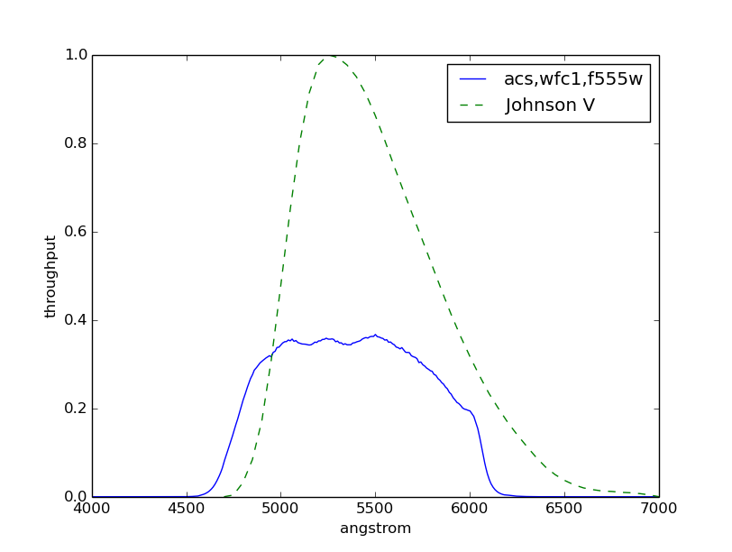
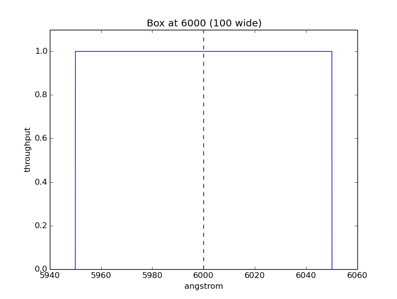

.. _pysynphot-bandpass:

********
Bandpass
********

A bandpass can be constructed by one of the following methods:

* Specifying a valid string of HST instrument mode keywords
  (:ref:`pysynphot-obsmode-bandpass`)
* Using a pre-defined function (:ref:`pysynphot-box-bandpass`)
* :ref:`Loading from a FITS or ASCII table <pysynphot-bandpass-from-file>`
* :ref:`Using your own wavelength and throughput arrays <pysynphot-bandpass-arrays>`

It has various :ref:`photometric properties <pysynphot-properties>` and these
main components:

* ``name`` (Description of the bandpass; Also accessible via
  :py:meth:`~object.__str__`)
* ``throughput``
* ``wave`` (a.k.a. ``waveset``)
* ``waveunits`` (see :ref:`pysynphot-wave-units`)

To evaluate its transmission at a given wavelength, use its
:meth:`~pysynphot.spectrum.SpectralElement.sample` or
:py:meth:`~object.__call__` method, as given in the following example.
Internally, evaluation uses :func:`numpy.interp`.

>>> bp = S.ObsBandpass('acs,wfc1,f555w')
>>> bp.sample(5000)
0.34331630723608403
>>> bp(5000)
0.34331630723608403

.. _pysynphot-obsmode-bandpass:

Observation Mode
================

The observation mode (``obsmode``) parameter defines the passband, i.e., the
wavelength-dependent sensitivity curve of the photometer or
spectrophotometer. It is controlled by :ref:`pysynphot-refdata`.
It can also be used to specify
:ref:`color index <pysynphot-tutorial-color-index>`.

The ``obsmode`` is usually given as a string of keyword arguments
to the `~pysynphot.obsbandpass.ObsBandpass` class.
The list of keywords identify the light path through the telescope and the
instrument, or through a non-HST filter system.
For example, ``"wfc3,uvis1,f555w"`` creates a bandpass that is calculated by
taking the product of the individual throughputs of the Wide Field
Camera 3 (WFC3) UVIS Channel 1, the F555W filter, the detector
sensitivity, and the HST Optical Telescope Assembly (OTA). There are special
considerations for :ref:`pysynphot-ota` and :ref:`pysynphot-costar`.
Another example, ``"johnson,v"`` creates a Johnson *V* bandpass that does not
account for HST optics. A complete list of ``obsmode`` keywords can be found in
:ref:`Appendix B <pysynphot-appendixb>`.

Quick Example
-------------

Create a bandpass for HST/ACS instrument with its WFC1 detector and F555W
filter:

>>> bp_acs = S.ObsBandpass('acs,wfc1,f555w')

To see which throughput tables are being used, as set by
:ref:`pysynphot-refdata`:

>>> bp_acs.showfiles()
/my/local/dir/cdbs/comp/ota/hst_ota_007_syn.fits
/my/local/dir/cdbs/comp/acs/acs_wfc_im123_004_syn.fits
/my/local/dir/cdbs/comp/acs/acs_f555w_wfc_005_syn.fits
/my/local/dir/cdbs/comp/acs/acs_wfc_ebe_win12f_005_syn.fits
/my/local/dir/cdbs/comp/acs/acs_wfc_ccd1_mjd_021_syn.fits

Create a bandpass for Johnson *V*:

>>> bp_v = S.ObsBandpass('johnson,v')

Compare them in a plot:

>>> plt.plot(bp_acs.binset, bp_acs(bp_acs.binset), 'b',
...          bp_v.wave, bp_v.throughput, 'g--')
>>> plt.xlim(4000, 7000)
>>> plt.xlabel(bp_acs.waveunits)
>>> plt.ylabel('throughput')
>>> plt.legend([bp_acs.name, 'Johnson V'], loc='best')

.. _pysynphot-command-range:

Pixel and Wavelength Ranges
---------------------------

The :meth:`~pysynphot.obsbandpass.ObsModeBandpass.pixel_range` and
:meth:`~pysynphot.obsbandpass.ObsModeBandpass.wave_range` methods can be used to
calculate the pixel and wavelength ranges, respectively, spanned by the
observation mode given its ``binset``, if available. For example:

>>> bp = S.ObsBandpass('wfc3,ir,f105w')

To calculate the number of pixels covered from 8600.5 to 12400.5 Angstroms:

>>> bp.pixel_range([8600.5, 12400.5])
3800

To calculate starting and ending wavelengths in Angstroms covered by 3800 pixels
centered at 10500 Angstroms:

>>> bp.wave_range(10500.0, 3800)
(8600.5, 12400.5)

.. _pysynphot-command-therm:

Thermal Background
------------------

For IR detectors (e.g., NICMOS and WFC3), thermal background can be calculated
using the :meth:`~pysynphot.obsbandpass.ObsModeBandpass.thermback` method.
The thermal component is defined by ``thermtable`` in :ref:`pysynphot-refdata`.
For non-IR detectors, calling this method would raise ``NotImplementedError``.
For example:

>>> bp = S.ObsBandpass('wfc3,ir,f105w')
>>> bp.thermback()
0.050852529496148512
>>> bp = S.ObsBandpass('acs,wfc1,f555w')
>>> bp.thermback()
NotImplementedError: No thermal support provided for acs,wfc1,f555w

.. _pysynphot-box-bandpass:

Box
===

A box-shaped bandpass is a rectangular window centered on a given wavelength
with a given width, both in Angstroms. It is defined as:

.. math::

    \textnormal{throughput} = \left \{
           \begin{array}{ll}
               1   & : x_0 - w/2 \geq x \geq x_0 + w/2 \\
               0   & : \textnormal{else}
           \end{array}
       \right.

where

* :math:`x_{0}` is the central wavelength
* :math:`x` is the wavelength array
* :math:`w` is the width of the box

The example below creates and plots a box-shaped bandpass centered at
6000 Angstroms with a width of 100 Angstroms:

>>> bp = S.Box(6000, 100)
>>> plt.plot(bp.wave, bp.throughput)
>>> plt.ylim(0, 1.1)
>>> plt.axvline(6000, ls='--', color='k')
>>> plt.xlabel(bp.waveunits)
>>> plt.ylabel('throughput')
>>> plt.title(bp.name)

.. _pysynphot-bandpass-uniform:

Flat
====

`~pysynphot.spectrum.UniformTransmission` generates a uniform (flat) bandpass
that has a constant throughput at any wavelength value.

The example below creates and samples a bandpass with a uniform transmission
value of 0.8:

>>> bp = S.UniformTransmission(0.8)
>>> bp.sample(5000)
0.8
>>> bp.sample(np.arange(1000, 10000))
array([ 0.8,  0.8,  0.8, ...,  0.8,  0.8,  0.8])

.. _pysynphot-bandpass-from-file:

From File
=========

A bandpass can also be defined using a FITS or ASCII table containing columns
of wavelength and throughput. See :ref:`pysynphot-io` for details on how to
create such tables.

The example below loads a bandpass from FITS table:

>>> filename = os.path.join(
...     os.environ['PYSYN_CDBS'], 'comp', 'acs', 'acs_wfc_ccd2_019_syn.fits')
>>> bp = S.FileBandpass(filename)
>>> bp.throughput
array([  0.00000000e+00,   0.00000000e+00,   1.87380003e-27, ...,
         4.14354995e-09,   0.00000000e+00,   0.00000000e+00])
>>> bp.sample(5100)
0.80144459009170532
>>> bp.sample(2100)
0.0

:ref:`pysynphot_tutorial_10` offers hints on how to load a bandpass from an ASCII table
of any format.

.. _pysynphot-bandpass-arrays:

From Arrays
===========

To create a bandpass from arrays, use `~pysynphot.spectrum.ArraySpectralElement`
(also callable as ``pysynphot.ArrayBandpass``). Note in the example below that
the bandpass is explicitly tapered at both ends to avoid extrapolation;
Also, unlike source spectrum, its negative throughput value is not automatically
set to zero:

>>> w = np.array([999, 1000, 2000, 3000, 3001])  # Angstroms
>>> t = np.array([0, 0.1, -0.2, 0.3, 0])
>>> bp = S.ArrayBandpass(w, t, name='MyBandpass')
>>> bp.throughput
array([ 0. ,  0.1, -0.2,  0.3,  0. ])
>>> bp.sample(2500)
0.049999999999999989
>>> bp.sample(4000)
0.0

.. _pysynphot-command-checko:

Overlap Checks
==============

To check whether the wavelength range of other bandpass or spectra is defined
everywhere within the main bandpass, you can use the
:meth:`~pysynphot.spectrum.SpectralElement.check_overlap` method, which returns
``"full"``, ``"partial"``, or ``"none"``. The example below checks whether
the main bandpass overlap with another bandpass of the same detector but with a
different filter, and with a box-shaped one:

>>> bp = S.ObsBandpass('wfc3,ir,f105w')
>>> other_bp = S.ObsBandpass('wfc3,ir,f110w')
>>> bp.check_overlap(other_bp)
'full'
>>> box_bp = S.Box(10000, 10000)
>>> bp.check_overlap(box_bp)
'partial'

To check if the lack of overlap is insignificant, you can use the
:meth:`~pysynphot.spectrum.SpectralElement.check_sig` method. The example
below shows that the partial overlap above is not a concern:

>>> bp.check_sig(box_bp)
True
