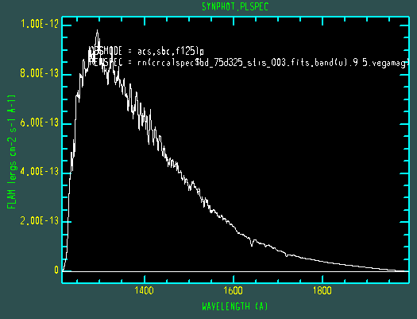
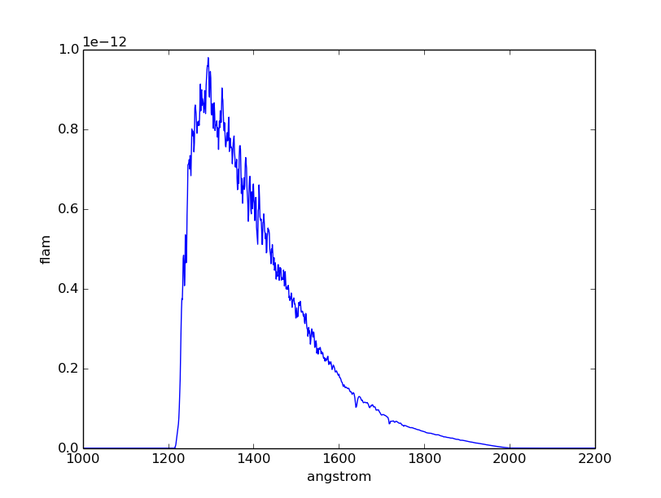

.. _pysynphot-iraf-switcher:

**********************************
Switching from IRAF STSDAS SYNPHOT
**********************************

This section provides basic switcher's guide for those who are familiar with
IRAF STSDAS SYNPHOT. This guide is not meant to be all-inclusive for two
reasons:

* Some of the SYNPHOT tasks can be reproduced in several different ways using
  **pysynphot**.
* Not all the SYNPHOT tasks are available in **pysynphot**.

The agreement of results between these two software were discussed in detail in
:ref:`TSR 2009-01: Pysynphot Commissioning Report (Laidler 2009) <synphot-ref-laidler2009>`.

In the tables below:

* ``sp`` represents a :ref:`source spectrum <pysynphot-spectrum>`
* ``bp`` represents a :ref:`bandpass <pysynphot-bandpass>`
* ``obs`` represents an :ref:`observation <pysynphot-observation>`

Source Spectrum
===============

=================================================== ===========================
**pysynphot**                                       SYNPHOT
=================================================== ===========================
S.FileSpectrum(filename)                            spec(filename)
S.BlackBody(temperature)                            bb(temperature)
S.FlatSpectrum(val, fluxunits=form)                 unit(val, form)
S.Powerlaw(refval, expon, fluxunits=form)           pl(refval, expon, form)
S.GaussianSource(totflux, mu, fwhm, fluxunits=form) em(mu, fwhm, totflux, form)
S.ArraySpectrum(wave, flux, fluxunits=form)         N/A
S.Icat(model, Teff, Z, log_g)                       icat(model, Teff, Z, log_g)
sp.renorm(val, form, bp)                            rn(sp, bp, val, form)
sp.redshift(z)                                      z(sp, z)
sp.writefits(filename)                              calcspec sp filename
plt.plot(sp.wave, sp.flux)                          N/A
=================================================== ===========================

Bandpass
========

There is no single bandpass method that is equivalent to IRAF STSDAS SYNPHOT
``bandpar`` task, but different commands can be used separately in order to
derive different photometric properties, as tabulated below.

================================ ===============================
**pysynphot**                    SYNPHOT
================================ ===============================
S.FileBandpass(filename)         thru(filename)
S.Box(mu, width)                 box(mu, width)
S.ObsBandpass(obsmode)           band(obsmode)
bp.avgwave()                     bandpar bp photlist=avglam
bp.efficiency()                  bandpar bp photlist=qtlam
bp.equivwidth()                  bandpar bp photlist=equvw
bp.rectwidth()                   bandpar bp photlist=rectw
bp.photbw()                      bandpar bp photlist=bandw
bp.throughput.max()              bandpar bp photlist=tpeak
bp.thermback()                   thermback obsmode
bp.writefits(filename)           calcband bp filename
plt.plot(bp.wave, bp.throughput) plband bp
================================ ===============================

Observation
===========

================================== ==================================
**pysynphot**                      SYNPHOT
================================== ==================================
S.Observation(sp, bp)              N/A
obs.countrate()                    calcphot bp sp counts
obs.effstim(form)                  calcphot bp sp form
obs.efflam()                       calcphot bp sp flam func='efflerg'
obs.writefits(filename)            N/A
plt.plot(obs.binwave, obs.binflux) plspec bp sp photlam
================================== ==================================

Miscellaneous
=============

========================= =========================
**pysynphot**             SYNPHOT
========================= =========================
S.Extinction(val, law)    ebmvx(val, law)
S.Extinction(val, 'gal1') ebmv(val)
S.Waveset(w1, w2, dw)     genwave filename w1 w2 dw
========================= =========================

.. _pysynphot-language-parser:

Language Parser
===============

**pysynphot** also has a special parser that can read some of the legacy
SYNPHOT language for spectrum objects. However, the parser cannot perform
legacy commands such as ``calcphot`` or ``bandpar``.

The following table lists the available operations:

=========================== ===================================================
Parser Syntax               Pythonic Equivalent
=========================== ===================================================
band(obsmode)               S.ObsBandpass(obsmode)
bb(temperature)             S.BlackBody(temperature)
box(mu, width)              S.Box(mu, width)
ebmvx(val, law)             S.Extinction(val, law)
em(mu, fwhm, totflux, form) S.GaussianSource(totflux, mu, fwhm, fluxunits=form)
icat(model, Teff, Z, log_g) S.Icat(model, Teff, Z, log_g)
pl(refval, expon, form)     S.Powerlaw(refval, expon, fluxunits=form)
rn(sp, bp, val, form)       sp.renorm(val, form, bp)
spec(filename)              S.FileSpectrum(filename)
unit(val, form)             S.FlatSpectrum(val, fluxunits=form)
z(sp, z)                    sp.redshift(z)
=========================== ===================================================

These are the flux units (``form``) recognized by the parser
(for wavelength, only Angstrom is accepted):

* ``fnu``
* ``flam``
* ``photnu``
* ``photlam``
* ``counts``
* ``abmag``
* ``stmag``
* ``obmag``
* ``vegamag``
* ``jy``
* ``mjy``

These are the reddening laws recognized by the parser.
They are used for the ``law`` variable in the ``ebmvx`` command above:

* ``gal1``
* ``gal3``
* ``smc``
* ``lmc``
* ``xgal``

This example shows how a blackbody can be generated using the parser and
the regular Python class. It also shows that they are both the same thing:

>>> from pysynphot import spparser as P
>>> bb1 = P.parse_spec('bb(5000)')
>>> bb2 = S.BlackBody(5000)   # Equivalent to bb1
>>> assert bb1.integrate() == bb2.integrate()

Meanwhile, this example shows how to use the parser to apply extinction to
a redshifted and renormalized spectrum obtained from a catalog. It also
generates the same spectrum using regular Python commands, and compares them:

>>> sp1 = P.parse_spec('ebmvx(0.1, lmc) * z(rn(icat(k93models, 5000, -0.5, 4.4), band(johnson,v), 18, abmag), 0.01)')
>>> sp2 = S.Extinction(0.1, 'lmc') * S.Icat('k93models', 5000, -0.5, 4.4).renorm(18, 'abmag', S.ObsBandpass('johnson,v')).redshift(0.01)
>>> assert sp1.integrate() == sp2.integrate()

Examples
========

In the examples below, the SYNPHOT commands are preceded by ``sy>``.
They are followed by the **pysynphot** equivalent in ``>>>``.
Some examples are adapted from SYNPHOT documentation.

IRAF STSDAS SYNPHOT setup::

    iraf> stsdas
    iraf> hst_calib
    iraf> synphot
    sy>

Calculate the pivot wavelength and the total flux (in counts/s) of a
5000 K blackbody in the HST/WFPC F555W bandpass. The blackbody spectrum is
normalized to have a *V* magnitude of 18.6::

    sy> calcphot "band(wfpc,f555w)" "rn(bb(5000),band(v),18.6,vegamag)" counts
    Mode = band(wfpc,f555w)
    Pivot       Equiv Gaussian
    Wavelength  FWHM
    5467.653    1200.953    band(wfpc,f555w)
    Spectrum:  rn(bb(5000),band(v),18.6,vegamag)
    VZERO      (COUNTS s^-1 hstarea^-1)
    0.           419.5938

>>> obs = S.Observation(
...     S.BlackBody(5000).renorm(18.6, 'vegamag', S.ObsBandpass('v')),
...     S.ObsBandpass('band(wfpc,f555w)'))
>>> obs.bandpass.pivot()
5467.6512917540995
>>> obs.countrate()
418.74429418688777

Calculate the total flux (in ``obmag``) of a 5000 K blackbody in the HST/ACS
WFC1 F555W bandpass for :math:`E(B-V)` values of 0.0, 0.25, and 0.5::

    sy> calcphot "acs,wfc1,f555w" "bb(5000)*ebmv($0)" obmag vzero="0.0,0.25,0.5"
    Mode = band(acs,wfc1,f555w)
    Pivot       Equiv Gaussian
    Wavelength  FWHM
    5361.008    847.9977    band(acs,wfc1,f555w)
    Spectrum:  bb(5000)*ebmv($0)
    VZERO      (OBMAG s^-1 hstarea^-1)
    0.           -10.0087
    0.25         -9.1981
    0.5          -8.39187

>>> for ebv in (0.0, 0.25, 0.5):
...     obs = S.Observation(
...         S.BlackBody(5000) * S.Extinction(ebv, 'gal1'),
...         S.ObsBandpass('acs,wfc1,f555w'))
...     print('{0}\t{1:.4f}'.format(ebv, obs.effstim('obmag')))
0.0	-10.0087
0.25	-9.1981
0.5	-8.3919

Plot an observation of BD+75 325 using the HST/ACS SBC F125LP bandpass in the
unit of ``flam``. The spectral data for BD+75 325 are stored in
``$PYSYN_CDBS/calspec/bd_75d325_stis_003.fits`` file. Because this spectrum has
been arbitrarily normalized in intensity, we must first renormalize it to its
proper *U* magnitude of 9.5::

    sy> plspec "acs,sbc,f125lp" "rn(crcalspec$bd_75d325_stis_003.fits,band(u),9.5,vegamag)" flam

>>> filename = os.path.join(
...     os.environ['PYSYN_CDBS'], 'calspec', 'bd_75d325_stis_003.fits')
>>> obs = S.Observation(
...     S.FileSpectrum(filename).renorm(9.5, 'vegamag', S.ObsBandpass('u')),
...     S.ObsBandpass('acs,sbc,f125lp'))
>>> obs.convert('flam')
>>> plt.plot(obs.wave, obs.flux)
>>> plt.xlim(1000, 2200)
>>> plt.xlabel(obs.waveunits)
>>> plt.ylabel(obs.fluxunits)

