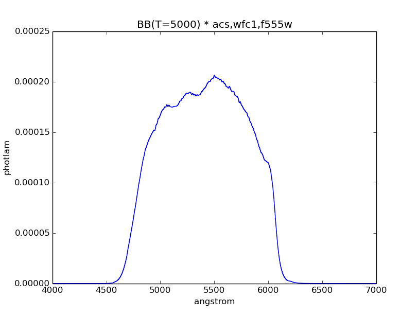
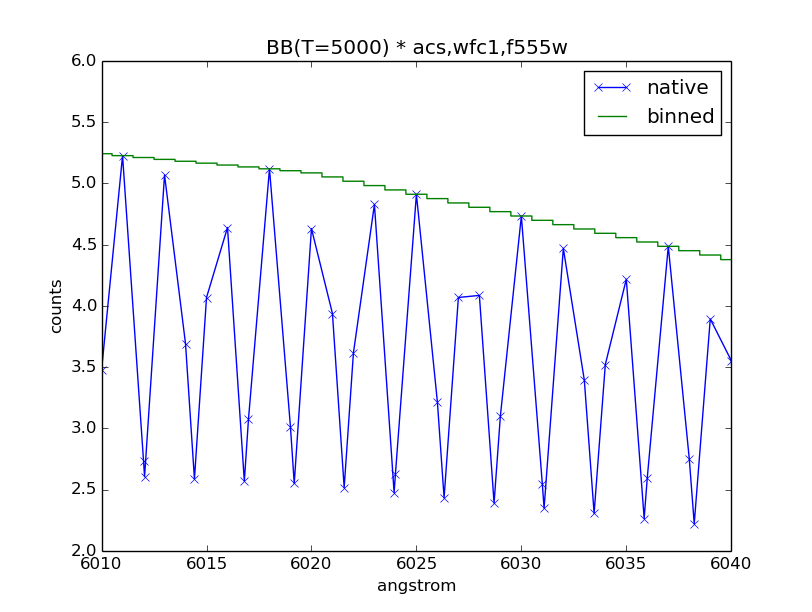

.. _pysynphot-observation:

***********
Observation
***********

`~pysynphot.observation.Observation` is a special type of
:ref:`pysynphot-spectrum`, where the source is convolved with a
:ref:`pysynphot-bandpass`, both which are stored in its ``spectrum`` and
``bandpass`` class attributes, respectively.

It also has two different datasets:

* ``wave`` and ``flux``, as defined by the native wavelength set, which is
  constructed when combining the source spectrum and the bandpass.
* ``binwave`` and ``binflux``, as defined by the binned wavelength set.

Binned wavelength set uses the optimal binning for the detector, if applicable.
When optimal binning is not found (e.g., a non-HST filter system), it uses the
native wavelength set instead (see :ref:`pysynphot-refdata`). For IRAF STSDAS
SYNPHOT users, this is the same behavior as the ``countrate`` task.
In addition, ``binwave`` can be explicitly overwritten using the ``binset``
keyword at initialization. Note that the given array must contain the central
wavelength values of the bins.

Once ``binwave`` is established, ``binflux`` is computed by integrating the
native flux over the width of each bin. Due to the nature of binned data,
``binflux`` cannot be interpolated when sampled. To accurately represent binned
dataset in a plot, you should plot it as a histogram, with each ``binwave``
value at the mid-point of the horizontal step (see
:ref:`pysynphot-observation-examples`).

In contrast, the native dataset is considered to be samples of a continuous
function. Thus, it may be interpolated linearly and plotted without using a
histogram.

An observation can be sampled using its
:meth:`~pysynphot.observation.Observation.sample` method. By default, it samples
the binned dataset and does not allow interpolation; i.e., you must provide
a wavelength value that exactly match that in ``binwave``. It will sample the
native dataset and allows interpolation if the ``binned=False`` option is used.
For for information, see :ref:`pysynphot-command-sample`.

The following operations are disabled because they do not make sense in the
context of an observation, in which a photon has passed through the telescope
optics:

* Redshift
* Addition/subtraction
* Some multiplication (see below)

When multiplication is performed, a new observation is created using its
original source spectrum and a new bandpass from multiplying its original
bandpass with the given bandpass or scalar number. An observation cannot be
multiplied with another observation, source spectrum, or extinction curve.

In addition, it has unique properties, such as :ref:`pysynphot-formula-effstim`
(also see :ref:`pysynphot-formula-countrate`) and
:ref:`pysynphot-formula-efflam`.

Like a source spectrum, an observation can be written to a FITS table using its
:meth:`~pysynphot.observation.Observation.writefits` method (also see
:ref:`pysynphot-io`), which in this case, takes an additional ``binned`` keyword
to indicate which dataset to write.

.. _pysynphot-formula-countrate:

Count Rate
----------

:meth:`~pysynphot.observation.Observation.countrate` is probably the most often
used method for an observation. It computes the total counts of a source
spectrum, integrated over the passband defined by a
:ref:`HST observing mode <pysynphot-obsmode-bandpass>`. For calculations, it
uses an optimal wavelength set (if available), which is constructed so that
one wavelength bin corresponds to one detector pixel.

It has two unique features below that are helpful when simulating a HST
observation. Therefore, it is ideally suited for predicting exposure times
(e.g., using `HST ETC <http://etc.stsci.edu/etc>`_) when writing HST proposals:

#. The input parameters were originally structured to mimic what is contained
   in the exposure logsheets found in HST observing proposals in
   `Astronomer's Proposal Tool (APT) <http://www.stsci.edu/hst/proposing/apt>`_.
#. For the spectroscopic instruments, it will automatically search for and
   use a :ref:`wavelength table <pysynphot-wavelength-table>` that is
   appropriate for the selected instrumental dispersion mode.

Examples its usage are available in :ref:`pysynphot-observation-examples`,
:ref:`Tutorial 1: Observation <pysynphot_tutorial_1_obs>`, and
:ref:`pysynphot_tutorial_7`.

.. _pysynphot-command-sample:

Sampling
--------

:meth:`~pysynphot.observation.Observation.sample` is another useful method
for an observation. It allows the computation of the number of counts at a
particular reference wavelength (in Angstroms) for either binned or native
dataset.

The example below computes the number of counts for :ref:`pysynphot-vega-spec`
at 10000 Angstroms, as observed by HST/WFC3 IR detector using F105W filter:

>>> refwave = 10000
>>> obs = S.Observation(S.Vega, S.ObsBandpass('wfc3,ir,f105w'))
>>> obs.sample(refwave)  # Binned dataset
6427997.452742151
>>> obs.sample(refwave, binned=False)  # Native dataset
32194062.511316653

In contrast, its :py:meth:`~object.__call__` method is the same as
:ref:`pysynphot-spectrum`. It always computes flux in ``photlam`` and can only
"see" the native dataset, as illustrated by the example below:

>>> obs(refwave)
142.0874566775498

.. _pysynphot-observation-examples:

Examples
--------

Simulate an observation of a 5000 K blackbody through the HST/ACS WFC1 F555W
bandpass, and plot its binned dataset:

>>> obs = S.Observation(S.BlackBody(5000), S.ObsBandpass('acs,wfc1,f555w'))
>>> plt.plot(obs.binwave, obs.binflux, drawstyle='steps-mid')
>>> plt.xlim(4000, 7000)
>>> plt.xlabel(obs.waveunits)
>>> plt.ylabel(obs.fluxunits)
>>> plt.title(obs.name)

Calculate the count rate of this observation in the unit of counts/s over the
HST collecting area (i.e., the primary mirror) that is defined in
:math:`\textnormal{cm}^{2}`:

>>> obs.primary_area
45238.93416
>>> obs.countrate()
10080.633086603169

Calculate the effective stimulus in ``flam``:

>>> obs.effstim('flam')
1.9951166916464598e-15

Calculate the effective wavelength in Angstroms:

>>> obs.efflam()
5406.9723492971034

Convert the flux unit to counts:

>>> obs.convert('counts')

Plot observation data in both native and binned wavelength sets. Note that
counts per wavelength bin depends on the size of the bin because it is not
a flux density:

>>> plt.plot(obs.wave, obs.flux, marker='x', label='native')
>>> plt.plot(obs.binwave, obs.binflux, drawstyle='steps-mid', label='binned')
>>> plt.xlim(6010, 6040)
>>> plt.ylim(2, 6)
>>> plt.xlabel(obs.waveunits)
>>> plt.ylabel(obs.fluxunits)
>>> plt.title(obs.name)
>>> plt.legend(loc='best')

Write the observation out to two FITS tables, one with native dataset and the
other binned:

>>> obs.writefits('myobs_native.fits', binned=False)
>>> obs.writefits('myobs_binned.fits')
