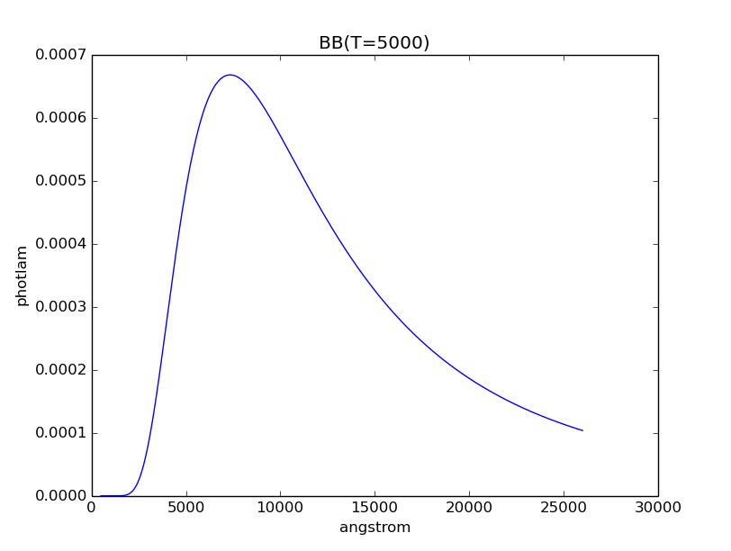
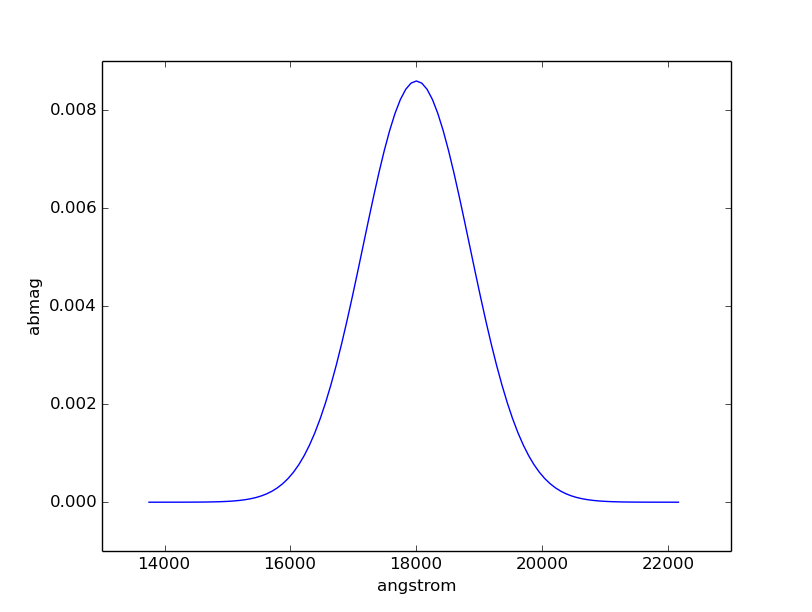
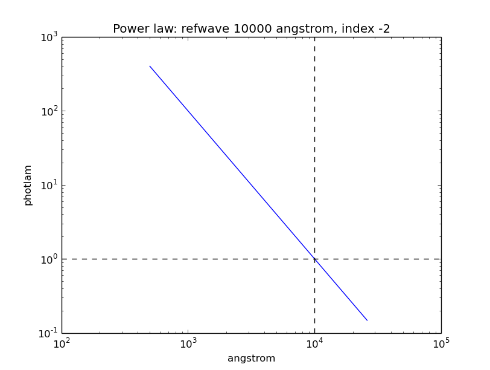
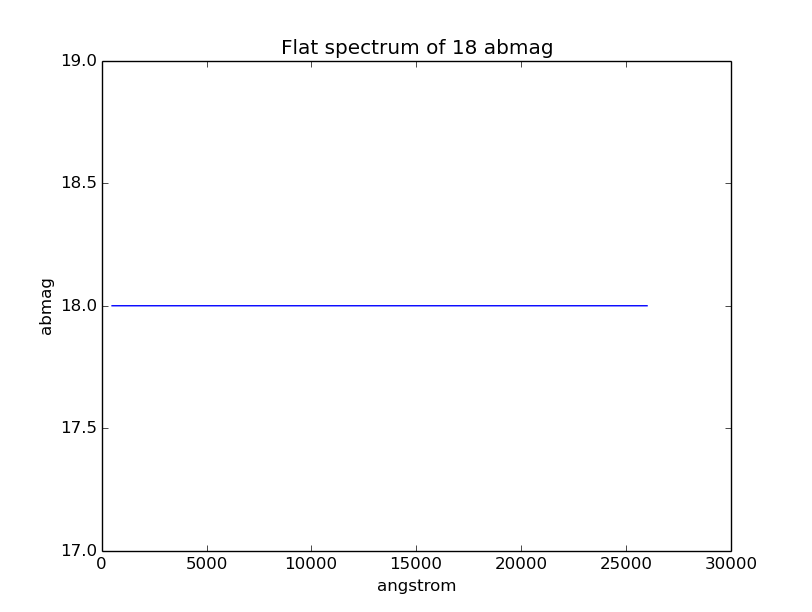
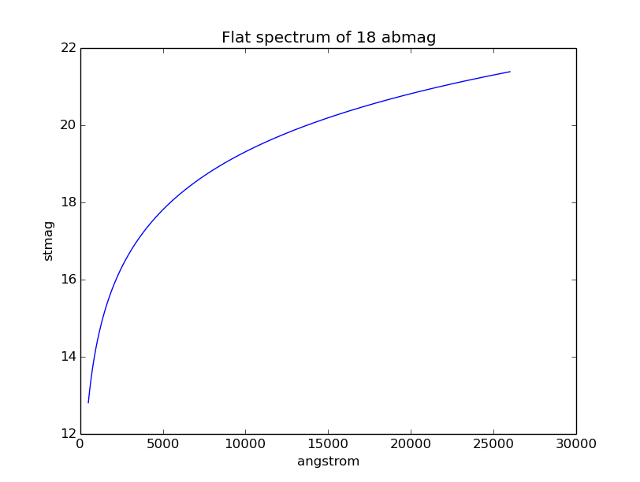
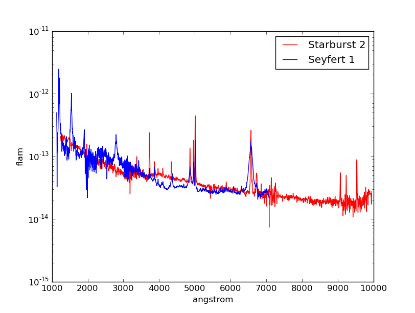
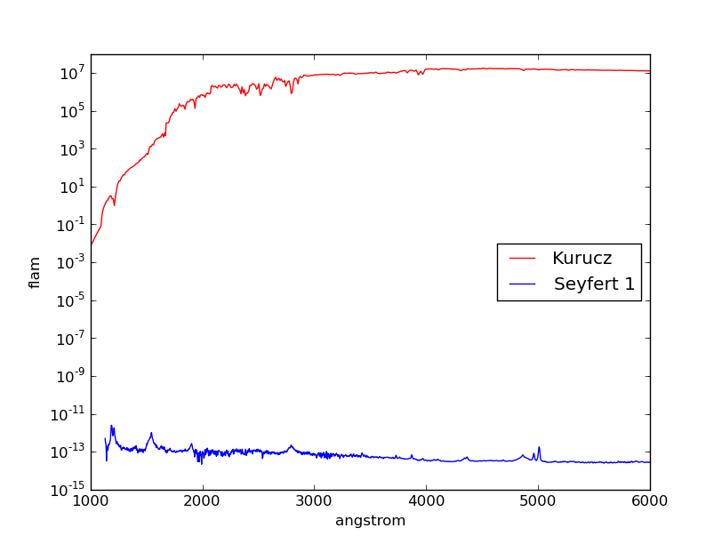
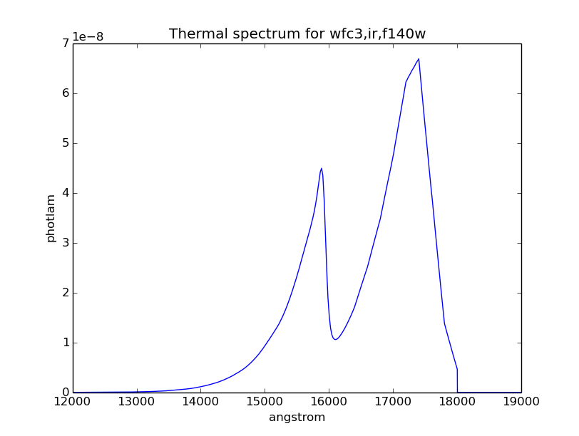
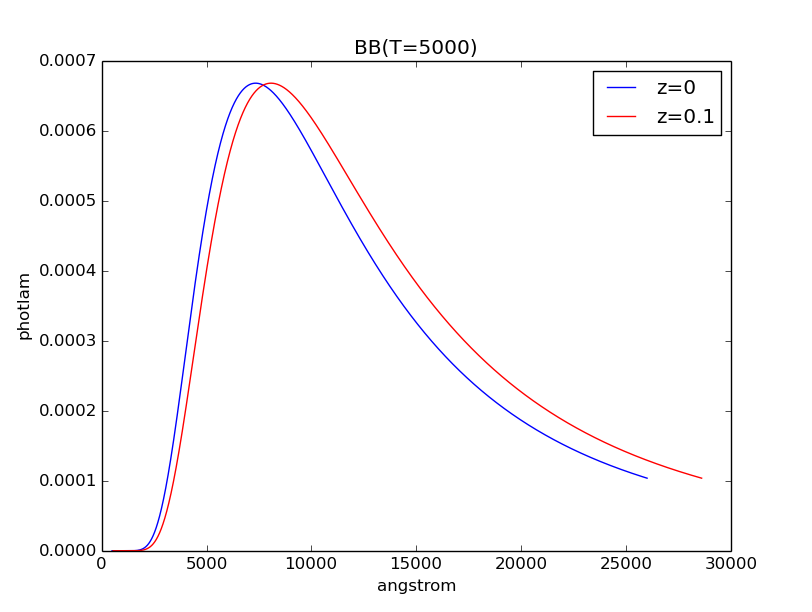
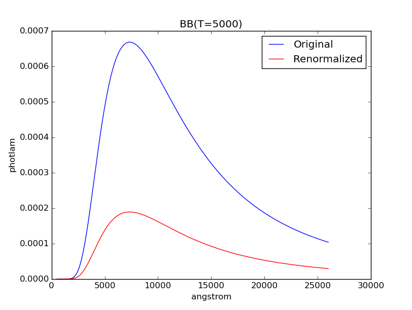

.. _pysynphot-spectrum:

***************
Source Spectrum
***************

A source spectrum is used to represent astronomical sources, such as stars and
galaxies. It can be constructed in
:ref:`several different ways <pysynphot-create-source>`.
An :ref:`observation <pysynphot-observation>` is a special case of a
source spectrum that is convolved with a :ref:`bandpass <pysynphot-bandpass>`.

A source spectrum has these main components:

* ``flux``
* ``fluxunits`` (see :ref:`pysynphot-flux-units`)
* ``isAnalytic`` (This is `True` if the spectrum can be defined by
  a mathematical formula. For instance, a Gaussian spectrum is analytic,
  but an empirical spectrum is not.)
* ``name`` (Description of the spectrum; Also accessible via
  :py:meth:`~object.__str__`)
* ``wave`` (a.k.a. ``waveset``)
* ``waveunits`` (see :ref:`pysynphot-wave-units`)

To evaluate its flux at a given wavelength, use its
:meth:`~pysynphot.spectrum.SourceSpectrum.sample` (uses ``fluxunits``) or
:py:meth:`~object.__call__` (uses ``photlam``) method, as given in the
following example. Internally, evaluation uses :func:`numpy.interp`.

>>> sp = S.Vega
>>> sp.fluxunits.name
'flam'
>>> sp.sample(5000)  # flam
4.7280365616415988e-09
>>> sp(5000)  # photlam
1190.0510381121621

.. _pysynphot-create-source:

Creating a Source
=================

A source spectrum can be constructed by one of the following methods:

* Using a pre-defined function (:ref:`pysynphot-planck-law`,
  :ref:`pysynphot-gaussian`, :ref:`pysynphot-powerlaw`, or
  :ref:`pysynphot-flat-spec`)
* Using built-in :ref:`pysynphot-vega-spec` spectrum
* :ref:`Reading from spectral atlas or catalog <pysynphot-spec-atlas>`
* :ref:`Loading from a FITS or ASCII table <pysynphot-source-from-file>`
* :ref:`Using your own wavelength and flux arrays <pysynphot-empirical-source>`
* :ref:`Thermal spectrum <pysynphot-thermal-spec>` is available for IR
  instruments but is usually not used directly

.. _pysynphot-planck-law:

Blackbody Radiation
-------------------

Blackbody radiation is defined by Planck's law
(:ref:`Rybicki & Lightman 1979 <synphot-ref-rybicki1979>`):

.. math::

    B_{\lambda}(T) = \frac{2 h c^{2} / \lambda^{5}}{\exp(h c / \lambda k T) - 1}

where the unit of :math:`B_{\lambda}(T)` is ``flam`` per steradian.

`~pysynphot.spectrum.BlackBody` generates a blackbody spectrum in
``photlam`` for a given temperature, normalized to a star of :math:`1 R_{\odot}`
at a distance of 1 kpc. Its ``waveset`` is taken from :ref:`pysynphot-refdata`.

The example below creates a blackbody spectrum at 5000 Kelvin:

>>> bb = S.BlackBody(5000)
>>> plt.plot(bb.wave, bb.flux)
>>> plt.xlabel(bb.waveunits)
>>> plt.ylabel(bb.fluxunits)
>>> plt.title(bb.name)

.. _pysynphot-gaussian:

Gaussian Emission
-----------------

`~pysynphot.spectrum.GaussianSource` could be used to represent an emission
line:

.. math::

    \sigma = \frac{\textnormal{FWHM}}{2 \; \sqrt{2 \; ln \; 2}}

    A = \frac{f_{\textnormal{tot}}}{\sqrt{2 \pi} \; \sigma}

    \textnormal{flux} = A \; / \; \exp(\frac{(x - x_{0})^{2}}{2 \; \sigma^{2}})

where

* FWHM is the full-width at half-maximum
* :math:`x_{0}` is the central wavelength
* :math:`x` is the wavelength array
* :math:`A` is the amplitude at :math:`x_{0}`
* :math:`f_{\textnormal{tot}}` is the total flux under the curve

Its ``waveset`` is defined such that the spectrum is more tightly sampled around
the peak. To create an absorption line, instead of adding the Gaussian source to
the continuum spectrum, you subtract it.

The example below creates a Gaussian source spectrum with total flux of
18.3 ``abmag`` under the curve, central wavelength of 18000 Angstroms, and
FWHM of 2000 Angstroms:

>>> gs = S.GaussianSource(18.3, 18000, 2000, fluxunits='abmag')
>>> gs.name
'Gaussian: mu=18000 angstrom,fwhm=2000 angstrom, total flux=18.3 abmag'
>>> plt.plot(gs.wave, gs.flux)
>>> plt.xlabel(gs.waveunits)
>>> plt.ylabel(gs.fluxunits)

.. _pysynphot-powerlaw:

Power-Law
---------

`~pysynphot.spectrum.Powerlaw` (also callable as ``pysynphot.PowerLaw``)
generates a power-law source:

.. math::

    \textnormal{flux} = (x \; / \; x_{0})^{-\alpha}

where

* :math:`x_{0}` is the reference wavelength
* :math:`x` is the wavelength array
* :math:`\alpha` is the powerlaw index

It is defined such that the flux is 1 (in given flux unit) at the reference
wavelength. Its ``waveset`` is taken from :ref:`pysynphot-refdata`.

The example below creates a power-law source spectrum with reference wavelength
of 10000 Angstroms and index of -2:

>>> pl = S.PowerLaw(10000, -2)
>>> plt.loglog(pl.wave, pl.flux)
>>> plt.axvline(10000, ls='--', color='k')
>>> plt.axhline(1, ls='--', color='k')
>>> plt.xlabel(pl.waveunits)
>>> plt.ylabel(pl.fluxunits)
>>> plt.title(pl.name)

.. _pysynphot-flat-spec:

Flat
----

`~pysynphot.spectrum.FlatSpectrum` generates a flat spectrum that has a constant
flux value in the given unit. Note that flux that is constant in a given unit
might not be constant in another, as illustrated in the example below.
Its ``waveset`` is taken from :ref:`pysynphot-refdata`.

The example below creates a source spectrum that is flat in ``abmag`` with the
amplitude of 18 mag:

>>> flatsp = S.FlatSpectrum(18, fluxunits='abmag')
>>> plt.plot(flatsp.wave, flatsp.flux)
>>> plt.xlabel(flatsp.waveunits)
>>> plt.ylabel(flatsp.fluxunits)
>>> plt.title(flatsp.name)

The spectrum above, however, is not flat in ``stmag``:

>>> flatsp.convert('stmag')
>>> plt.plot(flatsp.wave, flatsp.flux)
>>> plt.xlabel(flatsp.waveunits)
>>> plt.ylabel(flatsp.fluxunits)
>>> plt.title(flatsp.name)

.. _pysynphot-vega-spec:

Vega
----

**pysynphot** uses built-in Vega spectrum for ``vegamag`` calculations. This
spectrum comes with the package and is defined by
``pysynphot.locations.VegaFile``, which is loaded on import as
``pysynphot.spectrum.Vega`` (also callable as ``pysynphot.Vega``). Other
versions of Vega spectrum are available as
``$PYSYN_CDBS/calspec/alpha_lyr_*.fits``, which can be read using
:ref:`pysynphot-io` (also see :ref:`pysynphot-appendixa-calspec`).

The example below shows the built-in Vega spectrum:

>>> plt.plot(S.Vega.wave, S.Vega.flux)
>>> plt.xlim(0, 12000)
>>> plt.xlabel(S.Vega.waveunits)
>>> plt.ylabel(S.Vega.fluxunits)
>>> plt.title(os.path.basename(S.Vega.name))

.. image:: _static/vega_spec.png
    :width: 600px
    :alt: Vega spectrum.

.. _pysynphot-spec-atlas:

Catalogs and Spectral Atlases
-----------------------------

There are many :ref:`spectral atlases <pysynphot-appendixa>` consisting of both
observed and model data that are available for use with **pysynphot**.

Plotting the spectra is a handy way to explore the contents.
For instance, you are interested in making some HST observations of
Seyfert galaxies and want to see what sort of template spectra
are available to be used with **pysynphot** to predict observed count rates.
In this case, a good place to look would be in :ref:`pysynphot-appendixa-agn`
or :ref:`pysynphot-appendixa-kc96`. The example below plots the spectra of
a starburst and a Seyfert 1 galaxies from their respective atlases:

>>> starburst = S.FileSpectrum(os.path.join(
...     os.environ['PYSYN_CDBS'], 'grid', 'kc96', 'starb2_template.fits'))
>>> seyfert1 = S.FileSpectrum(os.path.join(
...     os.environ['PYSYN_CDBS'], 'grid', 'agn', 'seyfert1_template.fits'))
>>> plt.semilogy(starburst.wave, starburst.flux, 'r', label='Starburst 2')
>>> plt.semilogy(seyfert1.wave, seyfert1.flux, 'b', label='Seyfert 1')
>>> plt.xlabel(starburst.waveunits)
>>> plt.ylabel(starburst.fluxunits)
>>> plt.legend()

For most of the catalogs and atlases (except the three mentioned below), you
can load a spectrum :ref:`from file <pysynphot-source-from-file>` once you have
identified the desired filename that corresponds to the spectral parameters that
you want, as shown in the example above.

However, three of the atlases (:ref:`pysynphot-appendixa-ck04`,
:ref:`pysynphot-appendixa-kurucz1993`, and :ref:`pysynphot-appendixa-phoenix`)
have a grid of basis spectra which are indexed for various combinations of
effective temperature (:math:`T_{\textnormal{eff}}`) in Kelvin, metallicity
(``[M/H]``), and log surface gravity (:math:`\log g`). They are best
accessed with a special `~pysynphot.catalog.Icat` class.
You may specify any combination of the properties, so long as each is
within the allowed range, which differs from atlas to atlas. For example,
:ref:`pysynphot-appendixa-ck04` allows
:math:`3500 \; \textnormal{K} \le T_{\textnormal{eff}} \le 50000 \; \textnormal{K}`,
which means that no spectrum can be constructed for effective temperatures
below 3499 K or above 50001 K (i.e., an exception will be raised).
The example below obtains the spectrum for a
:ref:`pysynphot-appendixa-kurucz1993` model with
:math:`T_{\textnormal{eff}} = 6000 \; \textnormal{K}`, ``[M/H] = 0``, and
:math:`\log g = 4.3`:

>>> sp = S.Icat('k93models', 6440, 0, 4.3)

For completeness, the Kurucz spectrum is plotted below in comparison with
the Seyfert 1 from above. Note that the Kurucz spectrum has arbitrary
flux values and would need to be :ref:`renormalized <pysynphot-renorm>`
(not done here):

>>> plt.semilogy(sp.wave, sp.flux, 'r', label='Kurucz')
>>> plt.semilogy(seyfert1.wave, seyfert1.flux, 'b', label='Seyfert 1')
>>> plt.xlim(1000, 6000)
>>> plt.xlabel(sp.waveunits)
>>> plt.ylabel(sp.fluxunits)
>>> plt.legend(loc='center right')

.. _pysynphot-source-from-file:

From File
---------

A source spectrum can also be defined using a FITS or ASCII table containing
columns of wavelength and flux. See :ref:`pysynphot-io` for details on how to
create such tables.

The example below loads a source spectrum from FITS table, which happens to
be one of the :ref:`pysynphot-appendixa-calspec`:

>>> filename = os.path.join(
...     os.environ['PYSYN_CDBS'], 'calspec', 'g191b2b_mod_010.fits')
>>> sp = S.FileSpectrum(filename)
>>> sp.flux
array([  6.83127903e-12,   6.83185409e-12,   6.83168973e-12, ...,
         3.47564168e-21,   3.47547205e-21,   3.47530241e-21])

See :ref:`Tutorial 10 <pysynphot_tutorial_10>` for example on how to load a
source spectrum from an ASCII table of any format.

.. _pysynphot-empirical-source:

From Arrays
-----------

To create a source spectrum from arrays, use
`~pysynphot.spectrum.ArraySourceSpectrum` (also callable as
``pysynphot.ArraySpectrum``). Note in the example below that the flux value of
-2 is automatically set to 0, which can be disabled by indicating
``keepneg=True`` during initialization:

>>> w = np.array([1000, 2000, 3000])  # Angstrom
>>> f = np.array([1, -2, 3])  # photlam
>>> sp = S.ArraySpectrum(w, f, name='MySource')
Warning, 1 of 3 bins contained negative fluxes; they have been set to zero.
>>> sp.flux
array([ 1.,  0.,  3.])
>>> sp.sample(2500)
1.5

.. _pysynphot-thermal-spec:

Thermal
-------

`~pysynphot.spectrum.ThermalSpectralElement` handles a spectral element with
thermal properties. It is used in :ref:`pysynphot-obsmode-bandpass` for an IR
detector, particularly for
:meth:`~pysynphot.obsbandpass.ObsModeBandpass.thermback` calculation.

For instance, HST/WFC3 IR detector stores thermal information in
its ``$PYSYN_CDBS/comp/wfc3/*_th.fits`` files. In the table header (extension 1)
of each file, there are two keywords:

* ``DEFT``, the detector effective temperature in Kelvin; stored as
  ``temperature`` class attribute
* ``BEAMFILL``, the beam filling factor, usually 1; stored as
  ``beamFillFactor`` class attribute

**pysynphot** uses this information, applying the thermal emissivity to the
optical beam to create a thermal source spectrum, all done behind the scene via
:meth:`~pysynphot.observationmode.ObservationMode.ThermalSpectrum`, as follow:

1. :ref:`Blackbody source spectrum <pysynphot-planck-law>` is generated using
   the ``DEFT`` value and the :func:`~pysynphot.planck.bb_photlam_arcsec`
   function to calculate flux in ``photlam`` per square arcsec.
2. Thermal source spectrum is generated by multiplying the blackbody with
   `~pysynphot.spectrum.ThermalSpectralElement` emissivity and ``BEAMFILL``
   value.
3. If the observation mode has multiple thermal components, their respective
   thermal source spectra are added together.

The example below calculates the thermal background (in counts/pixel) for
HST/WFC3 IR F140W bandpass and plots its thermal source spectrum:

>>> bp = S.ObsBandpass('wfc3,ir,f140w')
>>> bp.thermback()
0.069428780630446163
>>> thsp = bp.obsmode.ThermalSpectrum()
>>> plt.plot(thsp.wave, thsp.flux)
>>> plt.xlim(12000, 19000)
>>> plt.xlabel(thsp.waveunits)
>>> plt.ylabel(thsp.fluxunits)
>>> plt.title('Thermal spectrum for {0}'.format(bp.obsmode))

Manipulating Source Spectrum
============================

Once you have created a source spectrum, you can manipulate it in several
different ways, namely creating a :ref:`pysynphot-composite-spectrum` from
different source spectra and/or bandpass, or applying
:ref:`pysynphot-extinction`, :ref:`pysynphot-redshift`, or
:ref:`pysynphot-renorm`.

.. _pysynphot-composite-spectrum:

Composite Spectrum
------------------

A composite spectrum is the resultant spectrum from adding, subtracting, or
multiplying two spectra, which can be a source spectrum or bandpass.
It retains the information of the input spectra as ``component1`` and
``component2`` class attributes. It does not compute the flux or throughput
until when explicitly sampled.
`~pysynphot.spectrum.CompositeSpectralElement` handles
operations between two bandpasses or between a bandpass and a number, while
`~pysynphot.spectrum.CompositeSourceSpectrum` handles everything else.
When an operation involves more than two spectra, the resultant composite
spectrum contains other composite spectra from intermediate steps (like a
binary tree).

The following table summarizes available operations in **pysynphot**:

=============== ============== =============== ========================== ===========
Operand 1       Operation      Operand 2       Result                     Commutative
=============== ============== =============== ========================== ===========
Source Spectrum :math:`-`      Source Spectrum Composite Source Spectrum  No
Source Spectrum :math:`+`      Source Spectrum Composite Source Spectrum  Yes
Source Spectrum :math:`\times` Bandpass        Composite Source Spectrum  Yes
Source Spectrum :math:`\times` Scalar number   Composite Source Spectrum  Yes
Bandpass        :math:`\times` Bandpass        Composite Spectral Element Yes
Bandpass        :math:`\times` Scalar number   Composite Spectral Element Yes
=============== ============== =============== ========================== ===========

The example below creates a :ref:`pysynphot-powerlaw` source with reference
wavelength of 10000 Angstroms and index of -2, and a :ref:`pysynphot-gaussian`
with total flux of :math:`8.3 \times 10^{-9}` ``flam`` under the curve, central
wavelength of 18000 Angstroms, and FWHM of 20 Angstroms. Then, the two spectra
are added together to create a new composite source spectrum. They are also all
plotted for visualization:

>>> plaw = S.PowerLaw(10000, -2)
>>> gss = S.GaussianSource(8.3e-9, 18000, 20, fluxunits='flam')
>>> sp = plaw + gss
>>> plt.semilogy(sp.wave, sp.flux, 'k', label='plaw+gss')
>>> plt.semilogy(plaw.wave, plaw.flux, 'b:', label='plaw')
>>> plt.semilogy(gss.wave, gss.flux, 'r--', label='gss')
>>> plt.xlim(17900, 18100)
>>> plt.xlabel(sp.waveunits)
>>> plt.ylabel(sp.fluxunits)
>>> plt.legend(loc='center')

.. image:: _static/added_spec_tutorial_1.png
    :width: 600px
    :alt: Spectrum addition from Tutorial 1.

.. _pysynphot-extinction:

Extinction
----------

You can also apply or remove the effects of interstellar reddening on a
source spectrum using `~pysynphot.reddening.Extinction` by providing a model
name and the value of :math:`E(B-V)` (negative value effectively de-reddens the
spectrum). The extinction is defined as:

.. math::

    R(V) = \frac{A(V)}{E(B-V)}

Extinction curves for **pysynphot** has been modeled for different
representative regions (see table below). They are available via CRDS
(see :ref:`pysynphot-installation-setup`) and must be installed under
the ``$PYSYN_CDBS/extinction`` directory. These are the same
`models used by Exposure Time Calculator (ETC) <http://etc.stsci.edu/etcstatic/users_guide/1_ref_7_ebv.html>`_.

Pre-defined extinction models are as tabulated below. The default model can be
specified in three different ways, which are all equivalent. Deprecated models,
which are superseded by newer ones but are retained for backward compatibility,
are taken from IRAF STSDAS SYNPHOT. The deprecated model, ``gal2``, is not
available in **pysynphot** and will raise an exception if used.

+--------+---------------------------+--------------------------------------------------------+
|Name    |Description                |Reference                                               |
+========+===========================+========================================================+
|gal3    |Milky Way Diffuse, R(V)=3.1|:ref:`Cardelli et al. (1989) <synphot-ref-cardelli1989>`|
|        |**(Default)**              |                                                        |
|mwavg   |                           |                                                        |
|        |                           |                                                        |
|`None`  |                           |                                                        |
+--------+---------------------------+                                                        |
|mwdense |Milky Way Dense, R(V)=5.0  |                                                        |
+--------+---------------------------+                                                        |
|mwrv21  |Milky Way CCM, R(V)=2.1    |                                                        |
+--------+---------------------------+                                                        |
|mwrv4   |Milky Way CCM, R(V)=4.0    |                                                        |
+--------+---------------------------+--------------------------------------------------------+
|lmc30dor|LMC Supershell, R(V)=2.76  |:ref:`Gordon et al. (2003) <synphot-ref-gordon2003>`    |
+--------+---------------------------+                                                        |
|lmcavg  |LMC Average, R(V)=3.41     |                                                        |
+--------+---------------------------+                                                        |
|smcbar  |SMC Bar, R(V)=2.74         |                                                        |
+--------+---------------------------+--------------------------------------------------------+
|xgalsb  |Starburst, R(V)=4.0        |:ref:`Calzetti et al. (2000) <synphot-ref-calzetti2000>`|
|        |(attenuation law)          |                                                        |
+--------+---------------------------+--------------------------------------------------------+
|gal1    |Milky Way **(Deprecated)** |:ref:`Seaton (1979) <synphot-ref-seaton1979>`           |
+--------+---------------------------+--------------------------------------------------------+
|gal2    |Milky Way **(Unavailable)**|:ref:`Savage & Mathis (1979) <synphot-ref-savage1979>`  |
+--------+---------------------------+--------------------------------------------------------+
|smc     |SMC **(Deprecated)**       |:ref:`Prevot et al. (1984) <synphot-ref-prevot1984>`    |
+--------+---------------------------+--------------------------------------------------------+
|lmc     |LMC **(Deprecated)**       |:ref:`Howarth (1983) <synphot-ref-howarth1983>`         |
+--------+---------------------------+--------------------------------------------------------+
|xgal    |Extra-galactic             |:ref:`Calzetti et al. (1994) <synphot-ref-calzetti1994>`|
|        |**(Deprecated)**           |                                                        |
+--------+---------------------------+--------------------------------------------------------+

The example below applies LMC (average) extinction with :math:`E(B-V) = 0.1`
to a :ref:`blackbody <pysynphot-planck-law>` with temperature of 5000 K.
Both the original and reddened spectra are plotted for comparison:

>>> sp = S.BlackBody(5000)
>>> sp_ext = sp * S.Extinction(0.1, 'lmcavg')
>>> plt.plot(sp.wave, sp.flux, 'b', label='E(B-V)=0')
>>> plt.plot(sp_ext.wave, sp_ext.flux, 'r', label='E(B-V)=0.1')
>>> plt.xlabel(sp.waveunits)
>>> plt.ylabel(sp.fluxunits)
>>> plt.title(sp.name)
>>> plt.legend(loc='best')

.. image:: _static/bb_ext_01.png
    :width: 600px
    :alt: Blackbody with and without extinction.

.. _pysynphot-redshift:

Redshift
--------

In **pysynphot**, redshifting a source spectrum is done by shifting the flux
location by:

.. math::

    \lambda_{obs} = (1 + z) \; \lambda_{rest}

The flux values themselves are not modified. This functionality is available
through the :meth:`~pysynphot.spectrum.SourceSpectrum.redshift` method, where
you provide the value of :math:`z`. You can also use this method to perform
blueshift (see :ref:`Tutorial 8 <pysynphot_tutorial_8>`).

The example below applies :math:`z = 0.1` to a
:ref:`blackbody <pysynphot-planck-law>` with temperature of 5000 K.
Both the original and the redshifted spectra are plotted for comparison:

>>> sp = S.BlackBody(5000)
>>> sp_z = sp.redshift(0.1)
>>> plt.plot(sp.wave, sp.flux, 'b', label='z=0')
>>> plt.plot(sp_z.wave, sp_z.flux, 'r', label='z=0.1')
>>> plt.xlabel(sp.waveunits)
>>> plt.ylabel(sp.fluxunits)
>>> plt.title(sp.name)
>>> plt.legend(loc='best')

.. _pysynphot-renorm:

Renormalization
---------------

A source spectrum can also be renormalized using
:meth:`~pysynphot.spectrum.SourceSpectrum.renorm` to a given flux value and unit
in a given bandpass. This is particularly useful when the flux of a source
spectrum (e.g., some models in :ref:`pysynphot-appendixa`) has been arbitrarily
renormalized before.

The example below renormalizes a :ref:`blackbody <pysynphot-planck-law>` with
temperature of 5000 K to 17 ``vegamag`` in Johnson *V*. Both the original and
the renormalized spectra are plotted for comparison:

>>> sp = S.BlackBody(5000)
>>> sp_norm = sp.renorm(17, 'vegamag', S.ObsBandpass('johnson,v'))
>>> plt.plot(sp.wave, sp.flux, 'b', label='Original')
>>> plt.plot(sp_norm.wave, sp_norm.flux, 'r', label='Renormalized')
>>> plt.xlabel(sp.waveunits)
>>> plt.ylabel(sp.fluxunits)
>>> plt.title(sp.name)
>>> plt.legend(loc='best')

