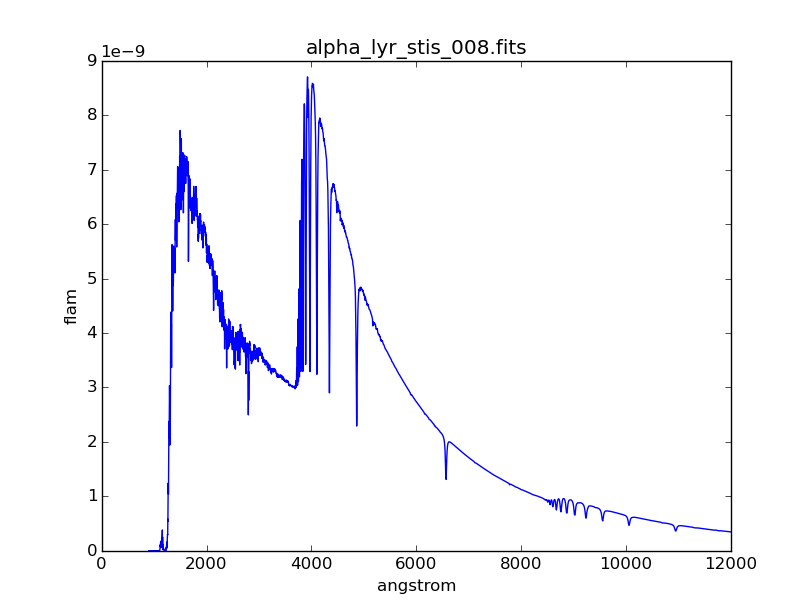
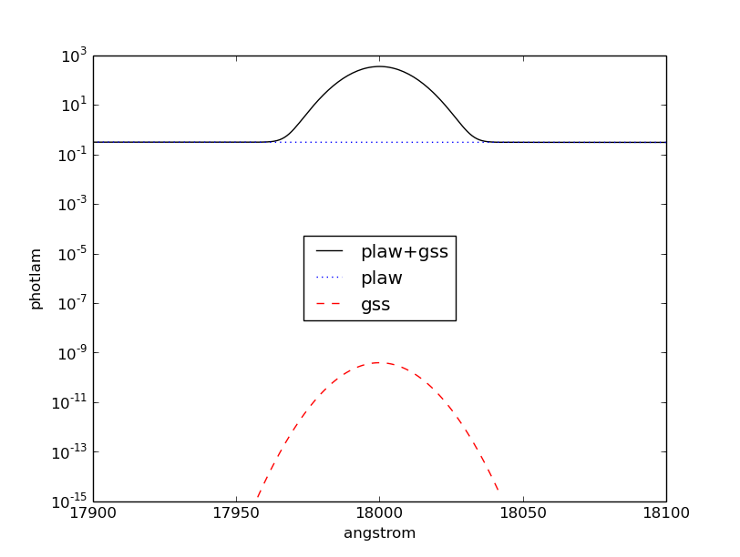
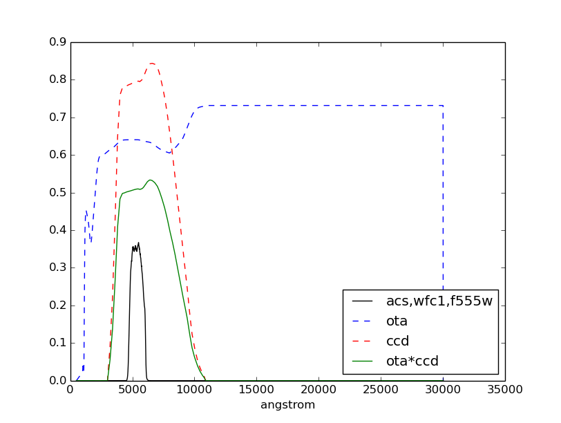
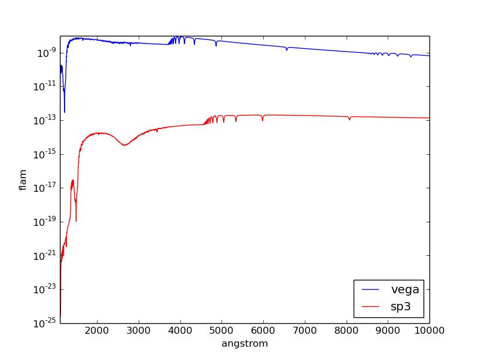
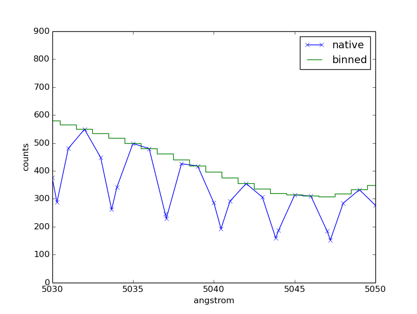
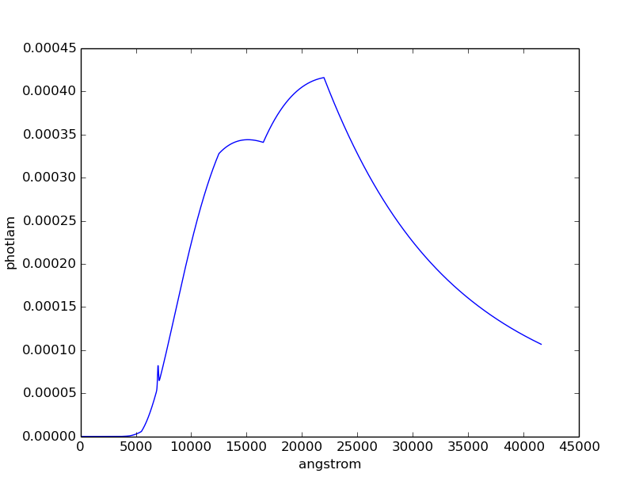
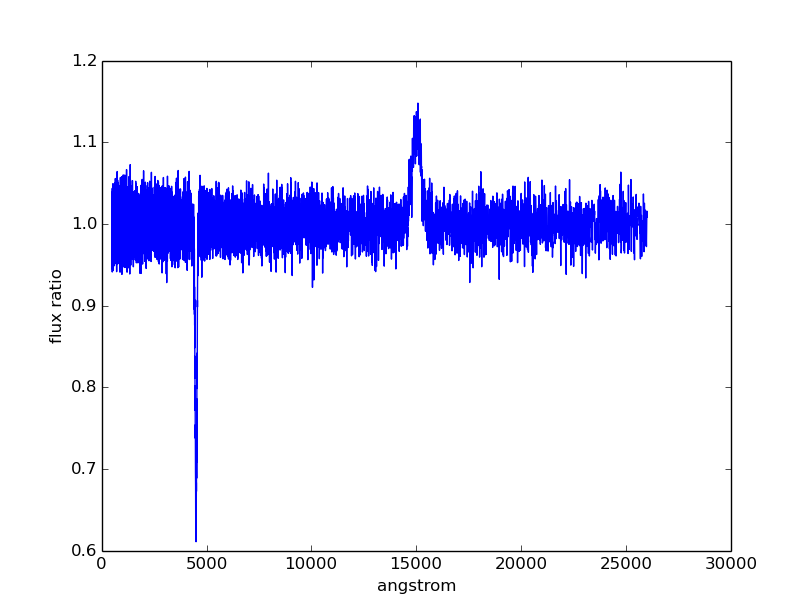

.. _pysynphot-tutorials:

*********
Tutorials
*********

These tutorials are for those who prefer to jump right in. There are also some
simple :ref:`exercises <pysynphot_tutorial_exercises>` for practice. You can
skip the parts involving plotting if you do not have ``matplotlib`` installed.

Before starting the tutorials, see :ref:`pysynphot-installation-setup`.

.. _pysynphot_tutorial_1:

Tutorial 1: The Basics
======================

In this tutorial, you will be introduced to the **pysynphot** software and
practice the following basic functionalities:

* Read spectra from files and display them using ``matplotlib``
* Create analytic source spectra
* Create a bandpass from observation mode string expression
* Manipulate spectrum objects
* Create an observation and compute its count rate and effective wavelength
* Write out spectra as FITS tables

Source Spectrum from File
-------------------------

Read a Vega spectrum (not the built-in version) from FITS table and
convert its flux unit to ``flam``:

>>> vega_file = os.path.join(
...     os.environ['PYSYN_CDBS'], 'calspec', 'alpha_lyr_stis_005.fits')
>>> vega = S.FileSpectrum(vega_file)
>>> vega.convert('flam')

Evaluate flux at 5000 Angstroms:

>>> vega(5000)  # photlam (internal unit)
1190.0510381121621
>>> vega.sample(5000)  # flam (user unit)
4.7280365616415988e-09

Plot the Vega spectrum:

>>> plt.plot(vega.wave, vega.flux)
>>> plt.xlim(0, 12000)
>>> plt.xlabel(vega.waveunits)
>>> plt.ylabel(vega.fluxunits)
>>> plt.title(os.path.basename(vega.name))

.. _pysynphot_tutorial_1_analytic:

Analytic Source Spectra
-----------------------

Create a blackbody source with a temperature of 40000 Kelvin:

>>> bb = S.BlackBody(40000)

Create a power-law source with reference wavelength of 10000 Angstrom and index
of -2:

>>> plaw = S.PowerLaw(10000, -2)

Create a Gaussian source with total flux of :math:`8.3 \times 10^{-9}` ``flam``
under the curve, central wavelength of 18000 Angstroms,
and FWHM of 20 Angstroms:

>>> gss = S.GaussianSource(8.3e-9, 18000, 20, fluxunits='flam')

Create a source that emits 1 count across all wavelengths:

>>> onecount = S.FlatSpectrum(1, fluxunits='counts')

Add Gaussian and power-law source spectra together to create a new source:

>>> sp = plaw + gss

Plot the combined spectrum and its individual components:

>>> plt.semilogy(sp.wave, sp.flux, 'k', label='plaw+gss')
>>> plt.semilogy(plaw.wave, plaw.flux, 'b:', label='plaw')
>>> plt.semilogy(gss.wave, gss.flux, 'r--', label='gss')
>>> plt.xlim(17900, 18100)
>>> plt.xlabel(sp.waveunits)
>>> plt.ylabel(sp.fluxunits)
>>> plt.legend(loc='center')

Bandpass from Observation Mode
------------------------------

Create a bandpass for HST/ACS instrument using its WFC1 detector and F555W
filter:

>>> bp1 = S.ObsBandpass('acs,wfc1,f555w')

Show all the components in the light path used to create the bandpass:

>>> bp1.showfiles()
/my/local/dir/cdbs/comp/ota/hst_ota_007_syn.fits
/my/local/dir/cdbs/comp/acs/acs_wfc_im123_004_syn.fits
/my/local/dir/cdbs/comp/acs/acs_f555w_wfc_005_syn.fits
/my/local/dir/cdbs/comp/acs/acs_wfc_ebe_win12f_005_syn.fits
/my/local/dir/cdbs/comp/acs/acs_wfc_ccd1_mjd_021_syn.fits

Read the OTA and CCD transmissions from files, then multiply them:

>>> ota = S.FileBandpass('/my/local/dir/cdbs/comp/ota/hst_ota_007_syn.fits')
>>> ccd = S.FileBandpass(
...     '/my/local/dir/cdbs/comp/acs/acs_wfc_ccd1_mjd_021_syn.fits')
>>> bp2 = ota * ccd

Plot the bandpass and overlay its two components from above:

>>> plt.plot(bp1.wave, bp1.throughput, 'k', label='acs,wfc1,f555w')
>>> plt.plot(ota.wave, ota.throughput, 'b--', label='ota')
>>> plt.plot(ccd.wave, ccd.throughput, 'r--', label='ccd')
>>> plt.plot(bp2.wave, bp2.throughput, 'g', label='ota*ccd')
>>> plt.xlabel(bp1.waveunits)
>>> plt.legend(loc='best')

Spectrum Manipulation
---------------------

Get extinction curve for Milky Way (diffuse) with :math:`E(B-V) = 0.7` and apply
it to Vega spectrum from above. Then, check that the flux is indeed reduced
by the extinction curve:

>>> extinct = S.Extinction(0.7, 'mwavg')
>>> extinct.citation
' Cardelli, Clayton, & Mathis (1989, ApJ, 345, 245) R_V = 3.10.'
>>> sp1 = vega * extinct
>>> max(vega.flux)
8.7730995298612719e-09
>>> max(sp1.flux)
5.06749522597244e-10

Redshift the reddened spectrum above by :math:`z = 0.23`. Then, check that the
peak wavelength is indeed redder:

>>> sp2 = sp1.redshift(0.23)  # sp2 is in PHOTLAM
>>> sp2.convert('flam')
>>> sp1.wave[sp1.flux == max(sp1.flux)][0]
5026.7534
>>> sp2.wave[sp2.flux == max(sp2.flux)][0]
6182.9067

Normalize the redshifted spectrum to a total flux of :math:`1.8 \times 10^{-13}`
``flam`` over HST/ACS WFC1 F555W bandpass from above:

>>> sp3 = sp2.renorm(1.8e-13, 'flam', bp1)

Plot the resultant spectrum and compare to the original Vega:

>>> plt.semilogy(vega.wave, vega.flux, 'b', label='vega')
>>> plt.semilogy(sp3.wave, sp3.flux, 'r', label='sp3')
>>> plt.xlim(1100, 10000)
>>> plt.xlabel(vega.waveunits)
>>> plt.ylabel(vega.fluxunits)
>>> plt.legend(loc='lower right')

.. _pysynphot_tutorial_1_obs:

Observation
-----------

Create an observation using modified Vega spectrum and HST/ACS WFC1 F555W
bandpass from above:

>>> obs = S.Observation(sp3, bp1)

Calculate count rate of this observation in the unit of counts/s over the HST
collecting area (i.e., the primary mirror) that is defined in
:math:`\textnormal{cm}^{2}`:

>>> obs.primary_area
45238.93416
>>> obs.countrate()
909477.56364769232

Calculate the count rate in
:math:`\textnormal{counts} \; \textnormal{s}^{-1} \; \textnormal{cm}^{-2}`:

>>> obs.countrate() / obs.primary_area
20.103868062653145

Calculate the effective stimulus in ``flam``:

>>> obs.effstim('flam')
1.7999999531057673e-13

Calculate effective wavelength in Angstroms:

>>> obs.efflam()
5425.0867727745972

Convert the flux unit to counts:

>>> obs.convert('counts')

Plot observation data in both native and binned wavelength sets. Note that
counts per wavelength bin depends on the size of the bin because it is not
a flux density:

>>> plt.plot(obs.wave, obs.flux, marker='x', label='native')
>>> plt.plot(obs.binwave, obs.binflux, drawstyle='steps-mid', label='binned')
>>> plt.xlim(5030, 5050)
>>> plt.xlabel(obs.waveunits)
>>> plt.ylabel(obs.fluxunits)
>>> plt.legend(loc='best')

Write the observation out to two FITS tables, one with native dataset and the
other binned:

>>> obs.writefits('myobs_native.fits', binned=False)
>>> obs.writefits('myobs_binned.fits')

.. _pysynphot_tutorial_2:

Tutorial 2: Adding Emission Line
================================

This tutorial is adapted from
`Exposure Time Calculator User's Guide on a similar topic <http://etc.stsci.edu/etcstatic/users_guide/1_ref_8.5_emlines.html#using-pysynphot-to-modify-emission-lines>`_.
In this tutorial, you will learn how to manipulate and superimpose
an emission line to a continuum spectrum.

Create a continuum spectrum of a 5500 K blackbody with :math:`z = 0.6`:

>>> bb = S.BlackBody(5500).redshift(0.6)

Create a Gaussian emission line with :math:`8 \times 10^{-14}` ``flam``
total flux under the curve and FWHM of 100 Angstroms centered at 7000 Angstroms:

>>> em = S.GaussianSource(8e-14, 7000, 100, fluxunits='flam')

Add emission line to continuum spectrum:

>>> sp = bb + em

Apply extinction curve for LMC (average) with :math:`E(B-V) = 1.3` to the
composite spectrum:

>>> my_spec = sp * S.Extinction(1.3, 'lmcavg')

Plot the result:

>>> plt.plot(my_spec.wave, my_spec.flux)
>>> plt.xlabel(my_spec.waveunits)
>>> plt.ylabel(my_spec.fluxunits)

.. _pysynphot_tutorial_3:

Tutorial 3: FWHM
================

This tutorial is adapted from an example in the documentation of
IRAF STSDAS SYNPHOT ``bandpar`` task. In this tutorial, you will learn
how to calculate the full-width at half-maximum (FWHM) of the
HST/WFPC instrument with F555W filter.

Create the bandpass:

>>> bp = S.ObsBandpass('wfpc,f555w')

Compute FWHM in Angstroms:

>>> np.sqrt(8 * np.log(2)) * bp.photbw()
1200.923243227332

.. _pysynphot-tutorial-color-index:

Tutorial 4: Color Difference
============================

This tutorial is adapted from an example in the documentation of
IRAF STSDAS SYNPHOT ``calcphot`` task. In this tutorial, you will learn
how to find the color difference of a 2500 K blackbody in Cousins *I* and
HST/WFC3 UVIS1 F814W bandpasses.

Create the blackbody:

>>> bb = S.BlackBody(2500)

Create an observation for each of the two bandpasses. Cousins *I* bandpass does
not have pre-defined ``binset``, so for consistency with the other bandpass,
it is to use the binning of HST/WFC3 UVIS1 detector:

>>> obs_wfc3 = S.Observation(bb, S.ObsBandpass('wfc3,uvis1,f814w'))
>>> obs_i = S.Observation(bb, S.ObsBandpass('i'), binset=obs_wfc3.binwave)

The color difference in magnitude is computed by subtracting the effective
stimuli of the two observations. In instrumental magnitude, this is:

>>> obs_i.effstim('obmag') - obs_wfc3.effstim('obmag')
-1.2585631331417577

The color difference in linear flux unit is computed by dividing the effective
stimuli of the two observations. In ``flam``, this is:

>>> obs_i.effstim('flam') / obs_wfc3.effstim('flam')
0.95505705250139461

.. _pysynphot_tutorial_5:

Tutorial 5: Continuum-Normalized Spectrum
=========================================

In this tutorial, you will learn how to create a composite spectrum with a noisy
blackbody continuum, an emission line, and an absorption line. Then, you will
divide it by a smooth continuum and plot the resultant continuum-normalized
spectrum.

Create the smooth continuum that is a 5000 K blackbody:

>>> bb = S.BlackBody(5000)

Add random noise to the continuum. Since **pysynphot** object cannot be
multiplied with Numpy array, this has to be done indirectly by applying the
noise to sampled flux array, and then use the results to build a new source
spectrum:

>>> w = bb.wave
>>> nse = 1 + np.random.normal(size=w.size, scale=0.02)
>>> bb_noisy = S.ArraySpectrum(wave=w, flux=bb(w)*nse)

Apply emission and absorption lines to the noisy continuum. How to construct a
Gaussian source is explained in
:ref:`Tutorial 1: Analytic Source Spectra <pysynphot_tutorial_1_analytic>`:

>>> g_em = S.GaussianSource(0.02, 15000, 500, fluxunits='photlam')
>>> g_ab = S.GaussianSource(0.015, 4500, 100, fluxunits='photlam')
>>> sp = bb_noisy + g_em - g_ab

Divide the spectrum above with the smooth continuum to obtain flux ratio.
Since **pysynphot** object cannot do division, this has to be calculated
indirectly using sampled flux arrays, which happen to be in ``photlam`` in
this example:

>>> fratio = sp(w) / bb(w)

Plot the continuum-normalized spectrum:

>>> plt.plot(w, fratio)
>>> plt.xlabel(sp.waveunits)
>>> plt.ylabel('flux ratio')

.. _pysynphot_tutorial_6:

Tutorial 6: Custom Wavelength Table
===================================

In this tutorial, you will learn how to create a custom wavelength array and
save it to a FITS table using `astropy.io.fits`. Then, you will read the array
back in from file, and use it to define binned dataset in an observation.

Suppose we want a wavelength set that ranges from 2000 to 8000 Angstroms, with
1 Angstrom spacing over most of the range, but 0.1 Angstrom spacing
around the [O III] forbidden lines at 4959 and 5007 Angstroms.

Create the 3 regions separately, concatenate them, and display the result:

>>> lowwave = np.arange(2000, 4950)
>>> midrange = np.arange(4950, 5010, 0.1)  # [O III]
>>> hiwave = np.arange(5010, 8000)
>>> wave = np.concatenate([lowwave, midrange, hiwave])
>>> wave
array([ 2000.,  2001.,  2002., ...,  7997.,  7998.,  7999.], dtype=float32)

Create a FITS table column from the concatenated array above, insert it
into a new FITS table, and write the table out to file:

>>> from astropy.io import fits
>>> col = fits.Column(
...     name='wavelength', unit='angstroms', format='E', array=wave)
>>> tabhdu = fits.BinTableHDU.from_columns([col])
>>> tabhdu.writeto('mywaveset.fits', clobber=True)

Read the custom wavelength set back in from file:

>>> with fits.open('mywaveset.fits') as pf:
...     wave = pf[1].data.field('wavelength')

Create an observation of Vega with HST/ACS WFC1 F555W bandpass, using the
custom wavelength set for binned data, and then check that the binned wavelength
set is indeed the given one:

>>> obs = S.Observation(S.Vega, S.ObsBandpass('acs,wfc1,f555w'), binset=wave)
>>> obs.binwave
array([ 2000.,  2001.,  2002., ...,  7997.,  7998.,  7999.], dtype=float32)

.. _pysynphot_tutorial_7:

Tutorial 7: Count Rates for Multiple Apertures
==============================================

In this tutorial, you will learn how to calculate count rates for observations
of the same source and bandpass, but with different apertures. Note that this
feature is only available for observing modes that allow encircled energy (EE)
radius specification (see :ref:`pysynphot-appendixb`).

Create two observations of Vega (renormalized to 20 ``stmag`` in Johnson *V*)
with HST/ACS WFC1 F555W bandpass, with 0.3 and 1.0 arcsec EE radii,
respectively:

>>> sp = S.Vega.renorm(20, 'stmag', S.ObsBandpass('johnson,v'))
>>> obs03 = S.Observation(sp, S.ObsBandpass('acs,wfc1,f555w,aper#0.3'))
>>> obs10 = S.Observation(sp, S.ObsBandpass('acs,wfc1,f555w,aper#1.0'))

Calculate the count rates for both and display the results:

>>> c03 = obs03.countrate()
>>> c10 = obs10.countrate()
>>> print('Count rate for 0.3" is {0}\n'
...       'Count rate for 1.0" is {1}'.format(c03, c10))
Count rate for 0.3" is 174.063405183
Count rate for 1.0" is 185.733901828

.. _pysynphot_tutorial_8:

Tutorial 8: Blueshift
=====================

In this tutorial, you will learn how to blueshift an observed spectrum back to
its rest frame. The blueshift value, :math:`z_{\textnormal{blue}}`, can be
calculated from the redshift, :math:`z`, as follows:

.. math::

    z_{\textnormal{blue}} = \frac{1}{1 + z} - 1

Create an observed blackbody spectrum at :math:`z = 0.1` (this is similar to the
example in :ref:`pysynphot-redshift`):

>>> z = 0.1
>>> bb = S.BlackBody(5000)
>>> sp_obs = bb.redshift(z)

Calculate and apply the blueshift, and then compare the result to the expected
values at rest frame (i.e., the original blackbody spectrum):

>>> z_blue = 1.0 / (1 + z) - 1
>>> sp_rest = sp_obs.redshift(z_blue)
>>> np.testing.assert_allclose(sp_rest.wave, bb.wave)
>>> np.testing.assert_allclose(sp_rest.flux, bb.flux)

.. _pysynphot_tutorial_9:

Tutorial 9: Bandpass ``stmag`` Zeropoint
========================================

HST bandpasses store their :ref:`pysynphot-formula-uresp` values under the
``PHOTFLAM`` keyword in image headers. This keyword is then used to compute
``stmag`` zeropoint for the respective bandpass (e.g.,
`ACS <http://www.stsci.edu/hst/acs/analysis/zeropoints>`_ and
`WFC3 <http://www.stsci.edu/hst/wfc3/phot_zp_lbn>`_).

In this tutorial, you will learn how to calculate the ``stmag`` zeropoint for
the F555W filter in HST/ACS WFC1 detector:

>>> bp = S.ObsBandpass('acs,wfc1,f555w')
>>> st_zpt = -2.5 * np.log10(bp.unit_response()) - 21.1
>>> print('STmag zeropoint for {0} is {1:.5f}'.format(bp.name, st_zpt))
STmag zeropoint for acs,wfc1,f555w is 25.65880

.. _pysynphot_tutorial_10:

Tutorial 10: Spectrum from Custom Text File
===========================================

In this tutorial, you will learn how to load a source spectrum from an ASCII
table that does not conform to the expected format stated in
:ref:`pysynphot-io`. Since `~pysynphot.spectrum.FileSourceSpectrum` does not
allow explicit setting of units, if your table data have non-default wavelength
or flux units, you have to first load them into Numpy arrays and then use
`~pysynphot.spectrum.ArraySourceSpectrum` to obtain the spectrum object
correctly. Similar workflow applies to bandpass for non-default
wavelength units, using `~pysynphot.spectrum.ArraySpectralElement` (not shown).

Let's say your ASCII table looks like this::

    # My source spectrum
    # ROW    WAVELENGTH(NM)    FLUX(PHOTLAM)
    1        400.0             0.1
    2        401.0             0.1234
    3        405.0             0.4556
    ...      ...               ...

There are many ways you can read the ASCII table into Numpy arrays. The example
below uses Astropy:

>>> from astropy.io import ascii
>>> tab = ascii.read('myfile.txt', names=['row', 'wave', 'flux'])
>>> wave = tab['wave']  # Second column
>>> flux = tab['flux']  # Third column

Construct the source spectrum from the arrays above:

>>> sp = S.ArraySpectrum(
...     wave=wave, flux=flux, waveunits='nm', fluxunits='photlam')

.. _pysynphot_tutorial_exercises:

Exercises
=========

Here are the exercises for those who wish to apply what they learned from
some of the tutorials above. Answers are not provided, but should be obvious
based on the available tutorials and documentation.

:ref:`pysynphot_tutorial_1`

1. Convert the blackbody source created in Tutorial 1 to ``flam`` flux unit.
   Plot it.

2. Create a bandpass for HST/WFC3 instrument using its UVIS1 detector and F475W
   filter. Plot it.

3. Create an observation using the blackbody source and the HST/WFC3 UVIS1
   F475W bandpass. Compute its count rate. Plot it.

:ref:`pysynphot_tutorial_2`

1. Create a Gaussian emission line with :math:`10^{-13}` ``flam``
   total flux under the curve and FWHM of 50 Angstroms centered at
   5000 Angstroms. Redshift it by :math:`z=0.01`.

2. Add this new emission line to the composite spectrum from Tutorial 2.
   Don't forget to account for the foreground LMC extinction.

3. Plot your result. You should see the same composite spectrum as in the
   tutorial but with an extra emission line that you created.

:ref:`pysynphot_tutorial_3`

1. Find the FWHM for HST/ACS WFC1 F555W bandpass.

2. Find the FWHM for a :ref:`box-shaped bandpass <pysynphot-box-bandpass>`
   centered at 3500 Angstroms with the width of 100 Angstroms.

:ref:`pysynphot-tutorial-color-index`

1. Find the color difference for the observations in Tutorial 4 in ``stmag``.

2. Find the color difference for the observations in Tutorial 4 in counts/s.

:ref:`pysynphot_tutorial_5`

1. Repeat the steps in Tutorial 5 but using blackbody temperature of 10000
   Kelvin.

2. Add a new absorption line of your choice to the spectrum that you just
   created. Recalculate and replot its flux ratio.
